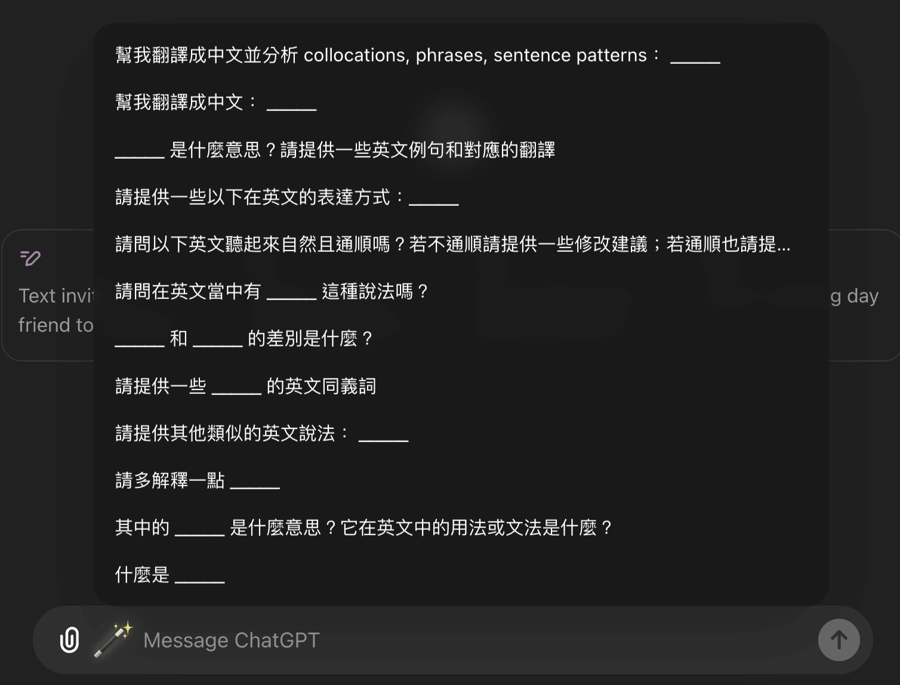
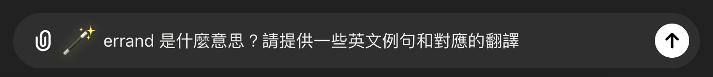
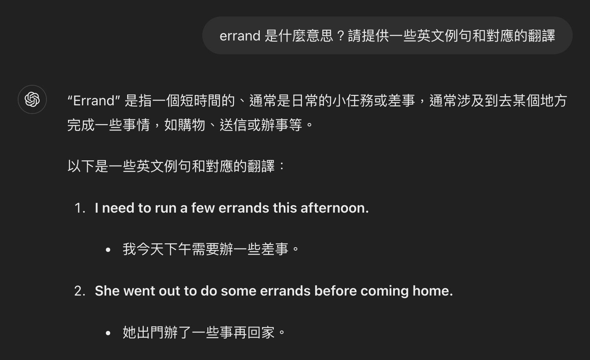

## 腳本連結

https://gist.github.com/ngseke/ed21fe10b575aae93746579e0139c068

> 點擊 **Raw** 按鈕即可快速安裝這個腳本（需要先安裝 [Tampermonkey](https://chromewebstore.google.com/detail/dhdgffkkebhmkfjojejmpbldmpobfkfo)）

## 說明





這個腳本可以讓你在 ChatGPT 快速輸入常用的短語，點擊輸入框左邊的「🪄」會顯示預先定義好的短語，特別的是只要點擊短語，它就會將**剪貼簿**的文字填入劃線 `___` 的部分並自動填入輸入框。



這個腳本很適合積極在學英文的人，像我近期就發現我會頻繁的會問 ChatGPT 某些問題，可能是偶爾看到不認識單字，想知道它的解釋和用法，或是想檢查自己剛寫的英文句子是否自然通順。這時只要把文字複製起來，再選擇對應的短語、送出，就可以迅速得到解答。



這個腳本當然也不只限定在英文學習的場景，修改腳本中第 `:14` 行的 `phrases` 便可以替換成符合自己需求的手句子，其中的 `${blank}` 會自動填充成剪貼簿中的文字。範例如下：

```javascript
  const phrases = [
    `什麼是 ${blank}？`,
    `${blank} 是什麼意思？`,
    `幫我回答這個問題並給出詳細的解法：\n${blank}`,
    // ...
  ]
```
