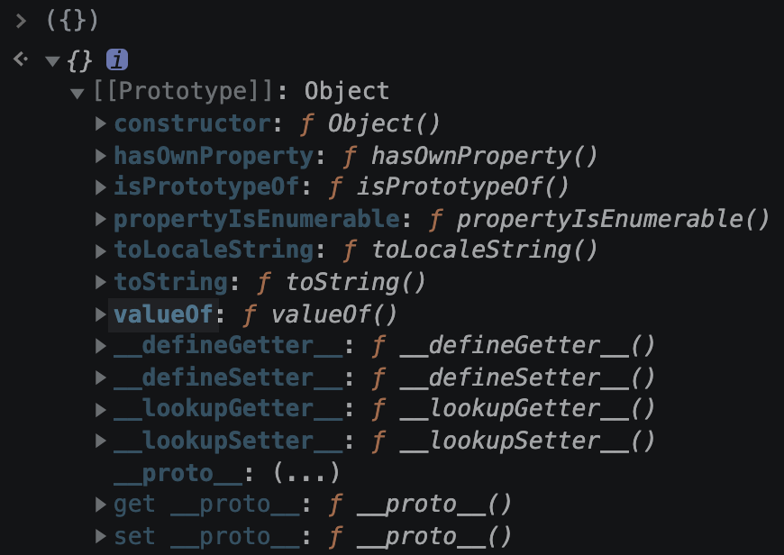

## `.hasOwnProperty()`

使用物件的 prototype `hasOwnProperty` 檢查。

**不會**遍歷原型鏈。

```javascript
const profile = {
  name: 'Sean',
  age: 24,
}

profile.hasOwnProperty('name') // true
profile.hasOwnProperty('valueOf') // false
```

## `in`

最簡潔的寫法，使用關鍵字 `in` 檢查。

但請留意 `in` **會**去尋找整個原型鏈，可能得到預期外的結果，並造成微乎其微的效能差異。

```javascript
const profile = {
  name: 'Sean',
  age: 24,
}

'name' in profile // true

/*
  ⚠️ 雖然以下 key 並沒有在 `profile` 中明確定義，
  但因為它們存在於物件的 prototype 中，所以依然會得到 true。
*/
'valueOf' in profile // true
'toString' in profile // true
'hasOwnProperty' in profile // true
```



> 效能實測：[hasOwnProperty 和 in 哪个性能高？ - frosen的回答 - 知乎](https://www.zhihu.com/question/301305485/answer/1644702242)


## `Object.prototype.hasOwnProperty.call()`

由於 JavaScript 未保護 `hasOwnProperty`，所以你完全可以複寫這個屬性，讓它刻意回傳錯誤的結果。

```javascript
const profile = {
  name: 'Sean',
  age: 24,
  hasOwnProperty: () => true,
}

/* 😢 現在無論傳入什麼都會得到 true */
profile.hasOwnProperty('🍺') // true
profile.hasOwnProperty(123) // true
```

利用 `Object.prototype.hasOwnProperty.call()` 即可避免此情況發生，也**不會**遍歷原型鏈。


```javascript
/* 😎 雖然冗長但最安全 */
Object.prototype.hasOwnProperty.call(profile, 'name') // true
Object.prototype.hasOwnProperty.call(profile, '🍺') // false
```


## `Object.hasOwn()`

[ES13](https://caniuse.com/mdn-javascript_builtins_object_hasown) 推出的新特性，旨在取代 `Object.prototype.hasOwnProperty()`，寫法相較之下更直觀簡潔。並且和 `Object.prototype.hasOwnProperty.call()` 一樣，即使複寫了 `hasOwnProperty` 依然可以得到正確的結果。

**不會**遍歷原型鏈。

```javascript
const profile = {
  name: 'Sean',
  age: 24,
  hasOwnProperty: () => true,
}

Object.hasOwn(profile, 'name') // true
Object.hasOwn(profile, '🍺') // false
```

## 其他常見但有陷阱的方法

### `Object.keys().includes()` 😐

先以 `Object.keys()` 取得物件的所有 key 的陣列，接著呼叫陣列的方法 `includes()` 來檢查 key 是否存在。

但這個方法的時間複雜度是 `O(n)`（[或更高](https://stackoverflow.com/a/64912755/12970551)），因為它必須先至少遍歷物件來得到所有的 key，接著尋找時又得再遍歷一次陣列，在 key 數量一多時顯然很沒效率。

**不會**遍歷原型鏈。

```javascript
const profile = {
  name: 'Sean',
  age: 24,
}

const keys = Object.keys(profile) // ['name', 'age']

keys.includes('name') // true
keys.includes('valueOf') // false
```


### `!== undefined` 😐

當試圖存取不存在於物件的 key 時，會得到 `undefined`。

但當某 key 存在而且值剛好是  `undefined` 時，那就仍會得到 `false`。

**會**遍歷原型鏈。

```javascript
const profile = {
  name: 'Sean',
  phone: undefined,
}

profile.address !== undefined // false
profile.phone !== undefined // ⚠️ false
```


### `!!` 或 `Boolean()` 😕

簡單暴力的寫法，也就是直接將值轉型成 boolean。但這方法顯然很不可靠，因為只要是 [*falsy*](https://developer.mozilla.org/zh-CN/docs/Glossary/Falsy) 值，例如 `0` 、空字串 `''` 、 `null` 等 ，即使 key 存在但依然會得到 `false`。

除非你對物件型別有十足的信心，例如在有 TypeScript 的場合，否則不太推薦這寫法。

**會**遍歷原型鏈。

```javascript
const profile = {
  name: 'Sean',
  balance: 0,
  isDead: false,
}

!!profile.name // true
!!profile.balance // ⚠️ false
Boolean(profile.isDead) // ⚠️ false
```

## 參考資料

- https://developer.mozilla.org/en-US/docs/Web/JavaScript/Reference/Global_Objects/Object/hasOwnProperty
- https://developer.mozilla.org/en-US/docs/Web/JavaScript/Reference/Global_Objects/Object/hasOwn
