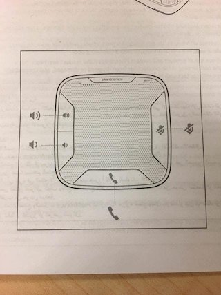

## 前言

Code Review 實在是太重要了，我想沒人會否認。

在軟體開發的世界中，需求不斷地變化是家常便飯，程式碼的可讀性和可維護性顯得格外重要。然而 Code Review 要看的多深、多仔細、花多少時間看，想找到適當的平衡點，其中分寸的拿捏確實是個挑戰。

但我始終認為有總比沒有好，畢竟 Code Review  是維持程式碼品質最有效的方式。相信大部分開發者都有同感： **「不是新需求難實現，而是舊的扣改不動。」** 有多少人曾被困在遺留代碼之中，為了加一個新功能，首先得耗費無數的精力，試圖理解那些又長又冗、變數胡亂命名的程式碼。接著才發現函式和函式之間耦合的嚴重，想要重構又因為副作用太多而不敢輕舉妄動。

因此在這篇文章中我想模擬這樣一個情境：

> 如果很嚴格地進行 Code Review，最吹毛求疵的那種，那看起來會像什麼樣子？

我將以各種壞味道的角度，分析一段出現在真實場景的程式碼，提供修改建議。同時也分享可套用的對應 ESLint 規則，其官方文件也會解釋這條規則存在的理由是什麼。

### Review 原則

1. 程式碼應具可讀性
2. 以盡量少的程式碼實現相同的功能
3. 避免潛在副作用和壞味道

## 需求描述

1. 函式接受任意字串，轉換成用來表示「計程車的數量」的數字字串，介於 `0` 至 `30`
2. 小於 `0` 時應總是得到 `0`；大於 `30` 時總是應得到 `30`
3. 無法用 `parseInt` 解析的字串一律轉換成 `0`
4. 轉換後的字串不足兩位數時，左邊補上 `0`

## 原程式碼片段

> 這 13 行代碼包括註解一字不差地擷自真實專案，其中的人名已替換成假名

```javascript
// 2021-11-23 Sean : 轉型 > 補0
const TaxiNumber = (v) => {
  // 正規表示
  let regex = new RegExp(/^\d{1,3}$/);
  // 叫車最小值、最大值
  let minTaxi = 0, maxTaxi = 30;
  // 轉型，利用轉型與輸入特性，處裡數字後字串
  v = parseInt(v);
  // 字串判斷？數值判斷
  v = regex.test(v.toString()) ? v < minTaxi ? minTaxi : v > maxTaxi ? maxTaxi : v : minTaxi;
  // 回傳 & 補0
  return v.toString().padStart(2, '0');
}
```

## 壞味道一：意圖不明的函式命名

```javascript
const TaxiNumber = (v) => {
      ^^^^^^^^^^
```

我首先注意到 `TaxiNumber` 這個單詞是大駝峰，當讀者單獨看時很容易產生困惑：它是用來展示計程車數字的 React Component 嗎？又或是 *class*？但都不是，它只是用來轉換字串的函式。

函式通常是以動詞開頭，而且應命名得清晰明瞭，能夠表達其功能或操作目的。

這類函式建議以 `convert`、`parse`、`format`、`normalize` 等動詞開頭，例如 `convertAToB`，且按照 JavaScript 慣例通常會以小駝峰命名。

> 💡 套用 ESLint 規則 [`camelcase`](https://eslint.org/docs/rules/camelcase) 可約束一致變數的命名風格。

## 壞味道二：縮寫的參數

```javascript
const TaxiNumber = (v) => {
                    ^
```

`v` 可能是 `value` 的縮寫，隨個人喜好略縮單詞是個常見的壞味道，通常只有作者本人才知道其背後的含義。但要知道身為團隊的一員，自己不會是唯一維護這段程式碼的人。命名前多花個幾秒仔細思考，將心比心地為下一個接手的人，甚至是一個月後的自己著想，確保它清晰易懂，任何人看了都能夠馬上理解。

建議替換成 `countString` ，或是任意一具描述性單詞。

> 💡 套用 ESLint 規則 [`id-denylist`](https://eslint.org/docs/rules/id-denylist) 可以定義「禁詞」，禁止使用這些單詞來命名，例如單字母 `a` `b` `c`，或是毫無意義的 `data`、`value`。

## 壞味道三：冗余的建構式

```javascript
  let regex = new RegExp(/^\d{1,3}$/);
              ^^^^^^^^^^
```

在這個情境並沒打算以 [template literals](https://developer.mozilla.org/en-US/docs/Web/JavaScript/Reference/Template_literals) 來動態產生 pattern，例如 ``new RegExp(`^{${a}}$`)``，所以可直接省略掉 `new RegExp()`，直接寫成更簡短的 `/^\d{1,3}$/` 即可。

> 💡 套用 ESLint 規則 [`prefer-regex-literals`](https://eslint.org/docs/rules/prefer-regex-literals) 來偏好採用 regular expression literals 寫法。

當能用更簡潔的寫法達成一模一樣的效果時，就沒理由選擇冗長的那個。其他類似的冗余的建構式還有這些：

- 寫 `{}` ，而非 `new Object()`
- 寫 `[]` ，而非 `new Array()`

> 💡 套用 ESLint 規則 [`no-new-object`](https://eslint.org/docs/rules/no-new-object) 和 [`no-array-constructor`](https://eslint.org/docs/rules/no-array-constructor) 來偏好採用 literal notation 寫法。


## 壞味道四：從未改變的 `let`

```javascript
  let minTaxi = 0, maxTaxi = 30;
  ^^^
```
一個簡單的原則是永遠優先使用 `const` 來宣告變數，除非真的有需要重新賦值。因此建議改寫成：

```javascript
/* 常見風格 */
const min = 0, max = 30

/* 陣列解構風格 */
const [min, max] = [0, 30]
```

順帶一提， `[number, number]` 的寫法在 TypeScript 中稱作 [tuple](https://www.typescriptlang.org/docs/handbook/2/objects.html#tuple-types)，在這隱含一種成雙成對的概念，有助於讀者把它們理解成是「一組範圍」的數字。

> 💡 套用 ESLint 規則 [`prefer-const`](https://eslint.org/docs/rules/prefer-const) 檢查從未被重新賦值的變數。支援 auto fix，可以自動將 `let` 替換成 `const`。

## 壞味道五：對參數重新賦值

```javascript
  v = parseInt(v);
    ^
```

無論任何語言，**複寫函式的參數**從來不是個好主意，可參考一些[針對 reassign parameter 的討論](https://www.google.com/search?q=reassign+parameter)。因為這很容易誤導讀者，原本預期傳入的參數是 string，但突然在某一行後卻硬生生變成了 number。

若專案有導入 TypeScript，某種程度也可以避免出現這種寫法，例如在此例中，因為新值顯然不符合參數原本的型別，compiler 便會直接報錯。

> 💡 套用 ESLint 規則 [`no-param-reassign`](https://eslint.org/docs/rules/no-param-reassign) 來防止參數被 reassign。

## 壞味道六：冗長的三元運算子

```javascript
  v = regex.test(v.toString()) ? v < minTaxi ? minTaxi : v > maxTaxi ? maxTaxi : v : minTaxi;
                                 ^^^^^^^^^^^^^^^^^^^^^^^^^^^^^^^^^^^^^^^^^^^^^^^^^^
```

巢狀的三元運算子，多個 `:` 與 `?` 交錯，沒有換行與縮排，缺乏可讀性。

建議採用具有更明確的語意的 `Math.min()` 和 `Math.max()` 方法改寫，並加上適當的換行和縮排。
```javascript
  v = regex.test(v.toString())
    ? Math.min(Math.max(v, minTaxi), maxTaxi)
    : minTaxi
```

> 💡 套用 ESLint 規則 [`no-nested-ternary`](https://eslint.org/docs/rules/no-nested-ternary) 來禁止巢狀的三元運算子。


## 壞味道七：深入變數的命名藝術

### `TaxiNumber`

`number` 一詞作為變數有點太籠統了，也沒有好好地起到描述的作用，說到底任何只要是數值的變數想必都是個 number。「寬度 width」是個 number，「角度 degree」也可以是個 number，「價格 price」更可以是個 number。

要描述這類變數，相信絕對找得到比 `number` 還更貼切的單詞。

根據需求它是用來表示「計程車的數量」，對於這類**計數/累加**的變數，建議可命名成 `count` 。

### `minTaxi`

第一眼見到 `minTaxi` 和 `maxTaxi` ，有點難想像其背後的含義是什麼。讀者可能會把他誤解成車型的大小，或是計程車的載客數。

在這個情況建議單純命名成 `min` 就行，把 `taxi` 當作後綴反而不適合，因為實際上要描述的是計程車的「數量」而非「計程車本身」。若想更精準的描述，可以考慮用 `minCount` 或 `minTaxiCount`。


## 壞味道八：「`// 齊天大聖，到此一遊`」

```javascript
// 2021-11-23 Sean : 轉型 > 補0
```

在未導入版控的遺留專案中，常見在註解裡出現作者的大名。但在現代軟體專案的想必都已導入 git，透過 git blame 就能追溯每一行的修改者是誰，何時修改的，以及對應的 commit message 等。

```javascript
  // 正規表示
  // 叫車最小值、最大值
  // 轉型，利用轉型與輸入特性，處裡數字後字串
  // 字串判斷？數值判斷
  // 回傳 & 補0
```

事實上，不只第一行的註解，這整段出現的所有的註解都是多餘的，因為程式碼做的事太顯而易見了，註解反而變成閱讀時的雜訊。善用能夠自我描述的變數和函式命名是最好的方法，因為它們本身就能夠清楚地傳達代碼的意圖，不再需要額外的註解。



## 最終重構結果

經過分析不難發現這個函式沒必要用上 RegExp，單純用 `parseInt()` 就足夠了。因為當傳入不合法的字串時，它就會一律回傳 `NaN`，也不會拋出任何錯誤。[KISS（Keep It Simple, Stupid）原則](https://en.wikipedia.org/wiki/KISS_principle)便很好地說明了這個道理，複雜的設計往往容易出錯，增加不必要的複雜度和 debug 的難度，因此應傾向以簡單和直接的方式解決問題，以保持程式碼的清晰度和可讀性。

總結上述幾點，以 TypeScript 重構後的程式碼長得像這樣：

```typescript
const parseTaxiCount = (countString: string) => {
  const [min, max] = [0, 30]
  const count = parseInt(countString) || 0
  const clampedCount = Math.min(Math.max(count, min), max)
  const paddedCount = String(clampedCount).padStart(2, '0')

  return paddedCount
}
```

最後也附上單元測試（Jest）：

```javascript
it('parseTaxiCount()', () => {
  expect(parseTaxiCount('')).toBe('00')
  expect(parseTaxiCount(' ')).toBe('00')
  expect(parseTaxiCount('-1')).toBe('00')
  expect(parseTaxiCount('0')).toBe('00')
  expect(parseTaxiCount('1')).toBe('01')
  expect(parseTaxiCount('01')).toBe('01')
  expect(parseTaxiCount('15')).toBe('15')
  expect(parseTaxiCount('30')).toBe('30')
  expect(parseTaxiCount('31')).toBe('30')
  expect(parseTaxiCount('999')).toBe('30')
  expect(parseTaxiCount('abc')).toBe('00')
  expect(parseTaxiCount('1a1')).toBe('01')
  expect(parseTaxiCount('30aaa')).toBe('30')
  expect(parseTaxiCount('030aaa')).toBe('30')
})
```

## 結語

以上分析是基於個人開發習慣而總結出的主觀意見，提供一些在 Code Review 時可作為參考的觀點，未必是最佳解。不同團隊也可能有各自獨特的風格，要知道 Code Review 的目的不僅僅是確保程式碼的品質和一致性，更是為了促進團隊的合作和溝通，讓開發者互相學習和分享最佳實踐、技巧和經驗，最終達成共識的一個過程。因此在過程中切記要保持開放討論的心態，提供具體且建設性的建議，而不單單是挑剔和指責。
