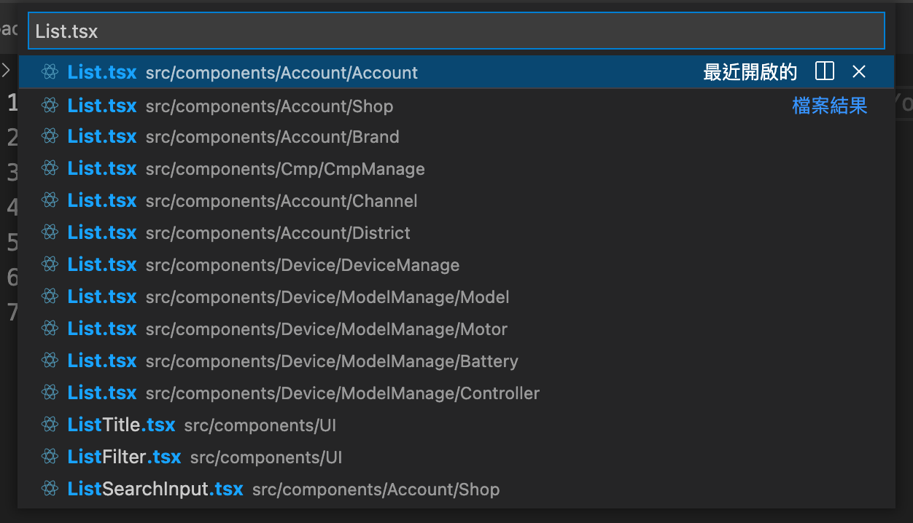
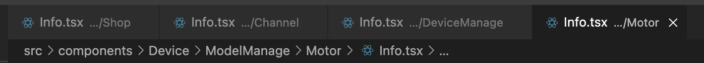
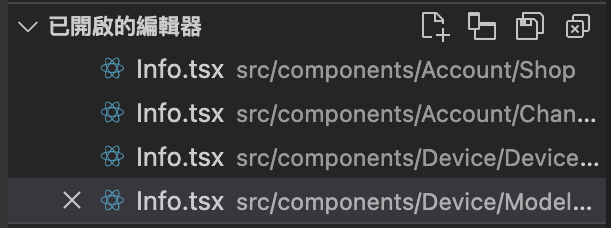

## 前言：30 秒越南語小教室 🇻🇳

越南語是**形容詞**後置的語言，恰恰和華語或英語相反。

例如「越南語」這個詞會寫成 **「語越南」**：

```javascript
Tiếng Việt Nam
 (語)  ( 越南 )
```

「台灣人」則會寫做 **「人台灣」**：
```javascript
Người Đài Loan
 (人)  ( 台灣 )
```

## 修飾語擺後面

在 Vue 官方風格指南中，組件命名的概念與越南語文法不謀而合。

若按照英語的文法，人們通常習慣這樣命名組件：

- <span class="text-rose-600">Primary *(a.)*</span> + <span class="text-sky-600"> Button *(n.)*</span> = **<span class="text-rose-600">Primary</span><span class="text-sky-600">Button</span>**
- <span class="text-rose-600">Date *(n.)*</span> + <span class="text-sky-600"> TextField *(n.)*</span> = **<span class="text-rose-600">Date</span><span class="text-sky-600">TextField</span>**
- <span class="text-rose-600">Confirm *(v.)*</span> + <span class="text-sky-600"> Dialog *(n.)*</span> = **<span class="text-rose-600">Confirm</span><span class="text-sky-600">Dialog</span>**

但如指南所述，它認為應該把**🔵主語/主詞**（文中所謂*高級別的詞*）擺到前面；**🔴修飾性的詞**則是放在結尾。形容詞、動詞或名詞都可算是修飾詞。

因此推薦的命名法如下：

- <span class="text-sky-600"> Button *(n.)*</span> + <span class="text-rose-600">Primary *(a.)*</span> = **<span class="text-sky-600">Button</span><span class="text-rose-600">Primary</span>**
- <span class="text-sky-600"> TextField *(n.)*</span> + <span class="text-rose-600">Date *(n.)*</span> = **<span class="text-sky-600">TextField</span><span class="text-rose-600">Date</span>**
- <span class="text-sky-600"> Dialog *(n.)*</span> + <span class="text-rose-600">Confirm *(v.)*</span> = **<span class="text-sky-600">Dialog</span><span class="text-rose-600">Confirm</span>**

## 在特定語境內的組件

對於在**🟢特定語境**內才有意義的的組件──也就是在某些個別頁面，或是只有在特定組件中用得到的子組件，指南中也建議以父組件或頁面名當作前綴

例如：

- <span class="text-teal-600"> Search *(父組件)*</span> + <span class="text-sky-600">TextField</span> + <span class="text-rose-600">Date</span> = **<span class="text-teal-600"> Search</span><span class="text-sky-600">TextField</span><span class="text-rose-600">Date</span>**
  Search 組件內專用的日期輸入框
- <span class="text-teal-600"> Search *(父組件)*</span> + <span class="text-sky-600">Button</span> + <span class="text-rose-600">Submit</span> = **<span class="text-teal-600"> Search</span><span class="text-sky-600">Button</span><span class="text-rose-600">Submit</span>**
  Search 組件內專用的送出按鈕
- <span class="text-teal-600"> LandingPage *(頁面)*</span> + <span class="text-sky-600">List</span> + <span class="text-rose-600">News</span> = **<span class="text-teal-600">LandingPage</span><span class="text-sky-600">List</span><span class="text-rose-600">News</span>**
  只在 Landing Page 用到的新聞列表
- <span class="text-teal-600"> LandingPage *(頁面)*</span> + <span class="text-sky-600">List</span> + <span class="text-rose-600">Features</span> = **<span class="text-teal-600">LandingPage</span><span class="text-sky-600">List</span><span class="text-rose-600">Features</span>**
  只在 Landing Page 用到的產品特色列表


## 停止巢狀資料夾！

你可能試過以[一層又一層](https://youtu.be/jGqpz3stgzY)的目錄來區分組件，像是：

```java
components/
  |- LandingPage/
     |- News/
        |- Item.tsx
        |- List.tsx
        |- Title.tsx
     |- Features.tsx
        |- Item.tsx
        |- List.tsx
        |- Title.tsx
```

但你其實可以放心、大膽地將它們都放在**同一層**資料夾。

重新調整後的目錄結構如下：

```java
components/
  |- LandingPageNewsItem.tsx
  |- LandingPageNewsList.tsx
  |- LandingPageNewsTitle.tsx
  |- LandingPageFeaturesItem.tsx
  |- LandingPageFeaturesList.tsx
  |- LandingPageFeaturesTitle.tsx
```


## But Why?

### 檔案總管的排序

絕大多數 IDE 例如 VSCode，它們的檔案總管都是按照**英文字母**排序的，所以前綴相同的那些文件，都會集中在一塊兒，從命名一眼就能看出哪些組件具有較高關聯性。

### 「滾動」比「展開資料夾」更無負擔

若要從茫茫組件庫的大海中找尋某個組件，一個一個點擊並展開深層的巢狀資料夾是非常惱人的。更別提有些打開、有些關閉的資料夾相互交錯混雜的畫面，看了更是令人煩躁不安。

相比之下，用滑鼠滾動在同一層目錄瀏覽，顯然更有效率且輕鬆許多。

### 移動組件的困難度

對於尚未導入 TypeScript 的專案，想移動組件可能是件大工程。因為 VSCode 可能無法理解組件之間的相依關係，而無法順利地自動進行重構。

假設有一個組件 `components/searchBar/Input/DateIuput.tsx`，今天我想將它提升至上層的 `components/Input/` 目錄，讓其他更多組件共用。然而我別無選擇，只能在專案中進行的全域搜尋並取代路徑字串，同時也得背負意外替換到其他無辜字串的風險。


### 撞名組件在視覺上難以定位

利用 `⌘ + P` 搜尋眾多同名的組件時，在 VSCode 裡很難快速定位到目標，因為它們乍看之下都一模一樣。



同樣地，出現在頁籤中的多個同名檔案也是讓人眼花撩亂。





## 結語

本文中所提到的命名方式並非強制性的，它只是一種風格，在實務上還是應該考量專案的規模，根據團隊固有的習慣來權衡。不過如果今天你要做的是個人的 side project（例如[本專案](https://github.com/ngseke/ngseke.me)），那我會非常推薦你不如大膽地嘗試看看。


## 參考資料

- https://zh.wikipedia.org/zh-tw/%E8%B6%8A%E5%8D%97%E8%AA%9E%E6%96%87%E6%B3%95
- https://v2.cn.vuejs.org/v2/style-guide
