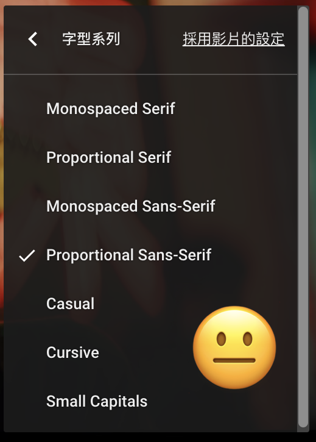
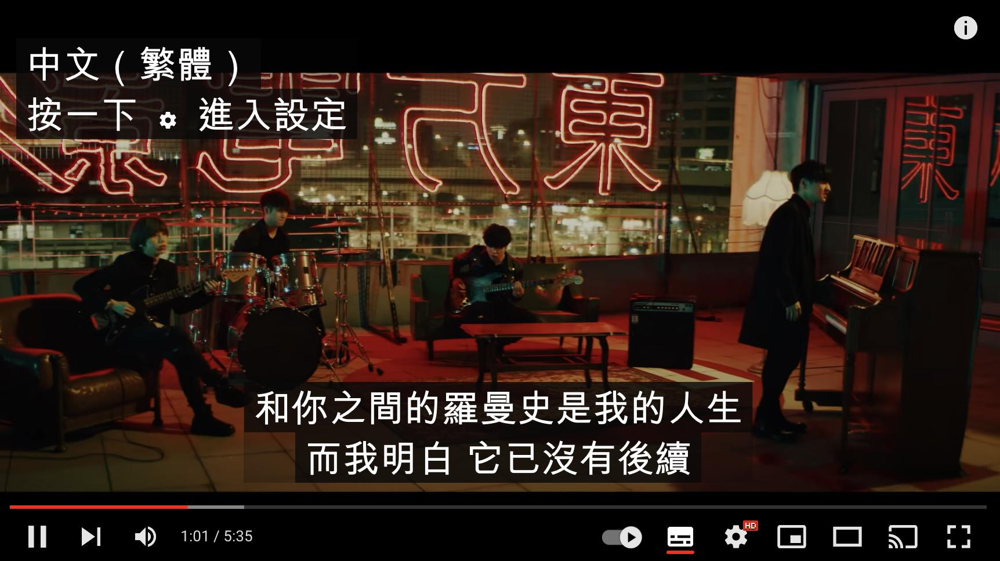
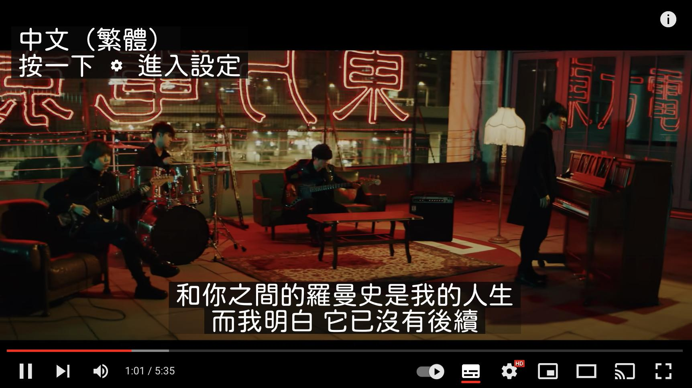

## 腳本連結

https://gist.github.com/ngseke/8b30050e05703f35c753cd0ac6330028

## 說明



YouTube CC 字幕雖然有內建設定字體的功能，然而可用的選項並不多，這些選項也都是基於英文字體。

如果你像我一樣對圓體有莫名的愛好，那你一定不能錯過這個腳本。它可以將 YouTube 的字幕替換成任何你想要的字體，前提是你的電腦要先安裝好該字體。


```javascript
const fontFamily = '"jf-openhuninn-1.1"'
//                   ^^^^^^^^^^^^^^^^^
```
將第 `:13` 行替換成想要的字體名稱即可，例如本例用的是開源圓體[「jf open 粉圓」](https://justfont.com/huninn/)，注意必須保留裡面的雙引號。

## 結果

**Before:**


**After:**

