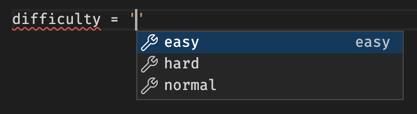
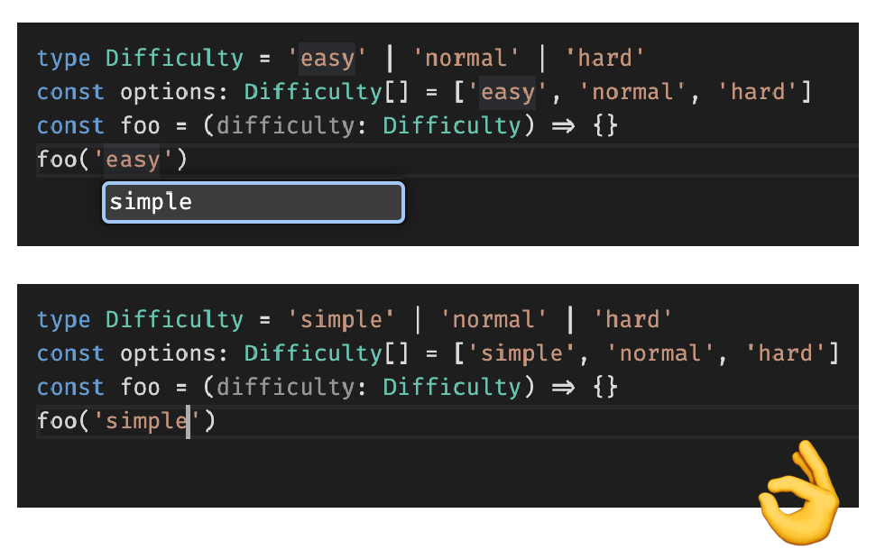

> 這篇文章討論的是 TypeScript 特有的「常數斷言（Const Assertion）」語法，
> 和 JavaScript 宣告常數所使用的 `const foo = 1` 是不同東西。

## 情境一：常數字串陣列

### 情境描述

[🎡 TS Playground](https://www.typescriptlang.org/play?#code/MYewdgzgLgBCAOUCW4IwLwwNoHICmAhhAJ44A0MOYIATgLYEA25lAFgTQCY4C6MMAKAFRi8PDAAiSAGbSkwAK6MRGGCLEhpcRCkhYwCugCM8NHkMZ5YnGXMXLiALkm35SlZhwBzEJxicCOjAYdi4cGAB6CJhAXg3ARD2gA)

想像我正在建立一個切換難易度的功能，有三種難度可選，先將他們宣告成陣列。

```typescript
const options = ['easy', 'normal', 'hard']
```

接著再建立一個變數 `difficulty`，用來記錄目前選中的難易度。

```typescript
type Difficulty = typeof options[number] // string

let difficulty: Difficulty = options[0]
```

但仔細一看型別 `Difficulty` 居然是 `string`，這也太隨便了，因為這代表我可以把 `difficulty` 設成隨便一個字串，TypeScript 也不會阻止我。

```typescript
difficulty = '安安' // 😑
```

### 解法

[🎡 TS Playground](https://www.typescriptlang.org/play?#code/MYewdgzgLgBCAOUCW4IwLwwNoHICmAhhAJ44A0MOYIATgLYEA25lAFgTQCY4C6MRMUJCgAoEVGLw8MACJIAZvKTAArowkYYEqSHlxEKSFjAq6AIzw0eYxnlicFS1euIAuWY+VqNmfEVJiDopeLpo47Fw4MAD00TCAoOQiQU7exGEEZsBRsTCAvBuA1XtiIkLQMPIgIJoAFMkhEu5ywc4SAJQYAHwwAN4xAFQwAHRDML1xAL5iCMioAwzwNZ7Naeid5SALTaktbTnxQA)

這時 `as const` （const assertion）就派上用場了！寫法就像**型別斷言**那樣。

```typescript
const options = ['easy', 'normal', 'hard'] as const

// 或是使用尖括弧（tsx 以外的檔案才能用這種寫法）
const options = <const>['easy', 'normal', 'hard']
```

如此即可得到預期中準確的型別。

```typescript
type Difficulty = typeof difficulties[number] // "easy" | "normal" | "hard"
```

搭配 VSCode 的 IntelliSense 可以得到代碼提示，也不再怕手殘拼錯字。（快速鍵 `⌘ + I` 呼出）




 `map()` 等回調函式的參數也會自動推斷出型別。

```typescript
// 假設有另一個函式參數要求傳入 `Difficulty`
const foo = (difficulty: Difficulty) => { /* ... */ }

// difficulty: "easy" | "normal" | "hard"
options.map(difficulty => foo(difficulty))
```

當然你也可以一開始就先把型別定義好，再以型別約束變數。
但我個人通常不太這麼做，因為這樣會重複出現很雷同的代碼，相當於需要費力維護多個真相來源。例如：

```typescript
type Difficulty = 'easy' | 'normal' | 'hard'
const options: Difficulty[] = ['easy', 'normal', 'hard']
```

不過把型別抽出來單獨定義，還是有額外好處的。假設因為需求改變，需要把 `'easy'` 改名成 `'simple'`，就可以活用 VSCode 的 **重新命名符號（Rename Symbol）** 功能來快速重構（從右鍵選單或快速鍵 `F2` 呼出）。

而這便是 `as const` 無法做到的，因此建議還是根據實際使用場景做權衡。



## 情境二：日期區間的 tuple

### 情境描述

[🎡 TS Playground](https://www.typescriptlang.org/play?#code/MYewdgzgLgBATgQzAcwKYwLwwNplQdxgBEEpUAKASgBoY9CSyqBdAKFYDMBXMYKAS3AwOIEDHKIUqAFw5GqWvOaUYAbxgB6AFQwAdPphaNMAL7sRICUjQqNxwLwbgar2gA)

想像我正在建立一個從開始到結束的**時間區間**變數 `range`，一樣宣告成陣列。

```typescript
const range = [new Date(), new Date()]
```

還有一個參數是時間區間的函式。

```typescript
function foo (range: [Date, Date]) { /* ... */ }
```

接著試著把 `range` 放入函式 `foo()` 中，但卻出現型別不相容的錯誤。

```typescript
foo(range)
// Argument of type 'Date[]' is not assignable to parameter of type '[Date, Date]'.
//   Target requires 2 element(s) but source may have fewer.(2345)
```

分析跳出的錯誤得知：
**`Date[]` 不可指派給 `[Date, Date]`**，因為函式只接受長度剛好是 `2` 的陣列，但 `range` 卻可能是任何長度的陣列。

TypeScript 說的確實沒錯，即使原本 `range` 是用 `const` 宣告，但我在中途還是有機會偷改他。例如 push 新的東西進去，或是執行 `range.length = 0` 來清空陣列，這些都會改變陣列的長度。


### 解法

[🎡 TS Playground](https://www.typescriptlang.org/play?#code/MYewdgzgLgBATgQzAcwKYwLwwNowFAwxioDuMAIglKgBQD0AVDAHSswN0CUANPocWUrV6TVs3Zc8AXRgIIMUJCh48AMwCuYYFACW4GKpAgYNRClQAueKgQATcABsAnjiGpebqZxgBvGIxY2DhgAXxVDEFMkNG86OhhAUHIVKCcAB3QAGVQUKAALTBgU9JBVeGjUZgds5Dz-eIAmIA)

試著加上 `as const`。

```typescript
const range = [new Date(), new Date()] as const
```

檢查 `range` 的型別，會發現它從原本的 `Date[]` 變成 `readonly [Date, Date]` 了。

```typescript
type MyRange = typeof range // readonly [23, 28]
```

此後便無法再對 `range` 進行任何會改變它的操作了。

```typescript
range.length = 0 // 🚫
range.push(new Date()) // 🚫
range.reverse() // 🚫
```

接著即可成功將 `range` 傳入函式。

```typescript
const range = [new Date(), new Date()] as const

function foo (range: readonly [Date, Date]) { /* ... */ }

foo(range) // ✅
```

留意函式的參數型別多加上了 `readonly` 關鍵字，那是用來告訴 TypeScript，這個函式不會去動到 `range`，例如執行 `range[0] = ...` 來重新賦值陣列的某個項目。

而試圖存取超出陣列範圍的項目時，TypeScript 也會提示錯誤。（JavaScript 的情況則是會無聲地得到 `undefined`）

```typescript
// ❌ Tuple type '[Date, Date]' of length '2' has no element at index '100'.(2493)
range[100]
```

甚至可以很明確地得知參數 `length` 的型別為 `2`
```typescript
type Length = typeof range.length // 2
```

### 總結

`as const` 套用在不同型別的變數上會得到不同的效果：

#### string、number、boolean

字面型別（literal type）加上 `as const` 後，型別就不會被「拓寬」，例如字串 `'hello'` 不會被推斷成 `string`，而是會維持原樣。

```typescript
let a = 'hello' // string
let b = 'hello' as const // 'hello'

let c = 123 // number
let d = 123 as const // 123

let e = true // boolean
let f = true as const // true
```

#### 陣列

陣列會被轉換成 readonly 的 tuple，也就是：
1. 唯獨，陣列裡面的值始終相同，也不能被修改
2. 長度永遠固定，不能執行 `push()` 或 `pop()` 等操作

```typescript
let a = [123, 'hello'] // (string | number)[]
let b = [123, 'hello'] as const // readonly [123, 'hello']
```

#### 物件

物件裡的**所有**屬性都會被加上 readonly，並且裡面的 string、number、boolean 和陣列值都會比照上述處理，型別不會被拓寬。

```typescript
let a = { text: 'hello', nested: { count: 123 } }
// {
//   text: string
//   nested: { count: number }
// }

let b = { text: 'hello', nested: { count: 123 } } as const
// {
//   readonly text: "hello"
//   readonly nested: { readonly count: 123; }
// }
```


<!-- `as const` 只能用在 string, number, boolean, 陣列或物件 literal。
 -->


## 參考資料
https://www.typescriptlang.org/docs/handbook/release-notes/typescript-3-4.html#const-assertions
