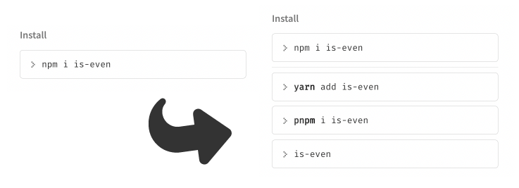
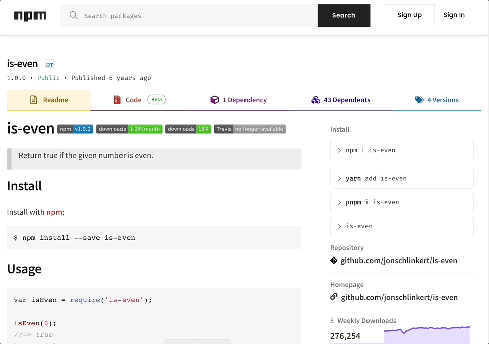

## 腳本連結

https://gist.github.com/ngseke/5e963dc85e1cb3b561564f8f6740cb7e

## Demo





## 說明

在 npm 套件頁面的右側欄加入 `yarn` 和 `pnpm` 安裝指令，方便一鍵複製。

另外可以手動修改腳本內的 `customCommandTemplates`，新增更多自定義的指令：

```javascript
const customCommandTemplates = [
  `yarn add ${placeholder}`,
  `pnpm i ${placeholder}`,
  `${placeholder} `,
  // ...
]
```
