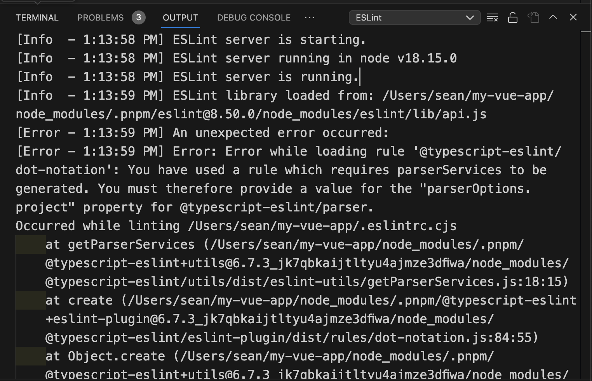
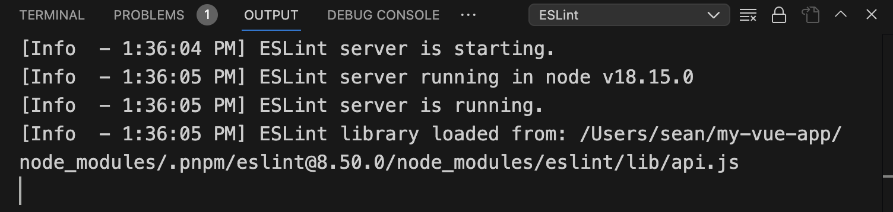
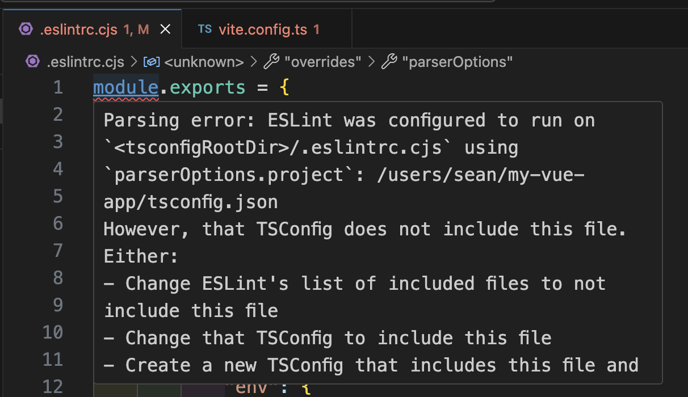
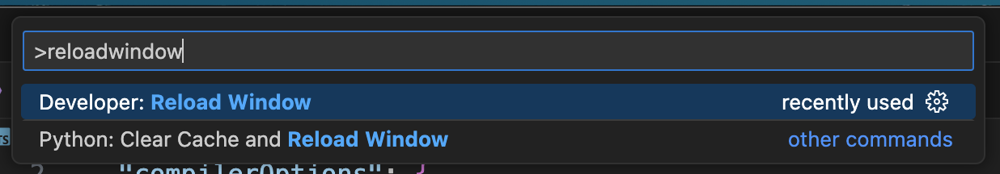
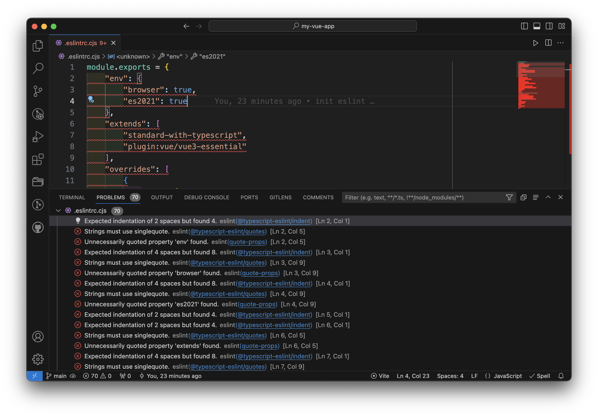
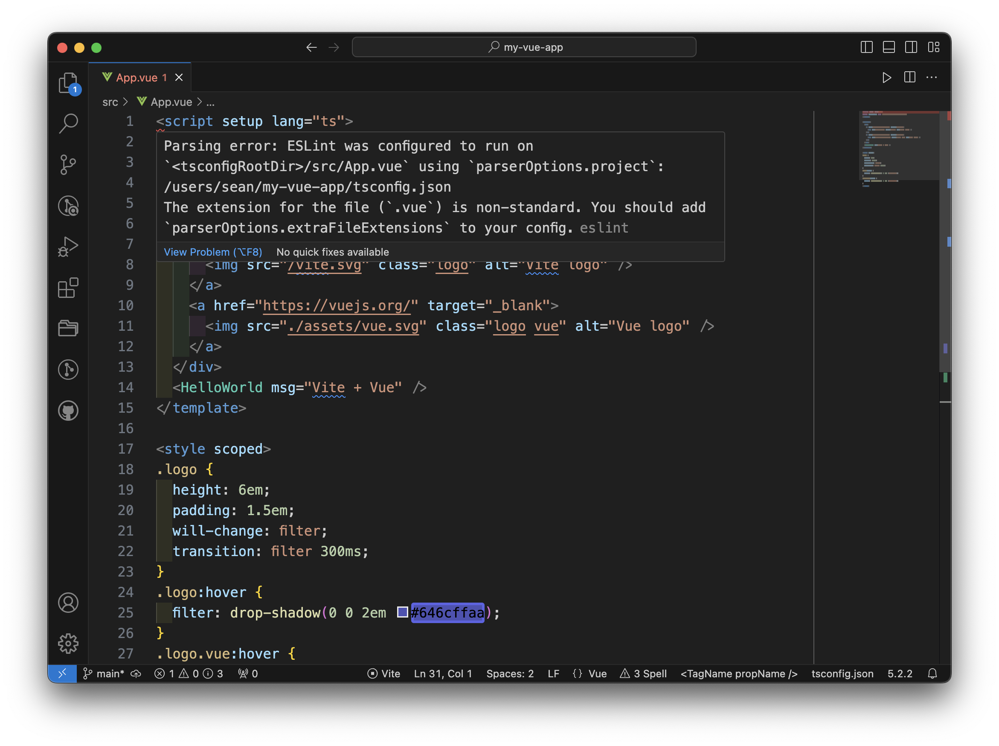
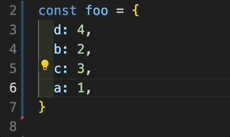
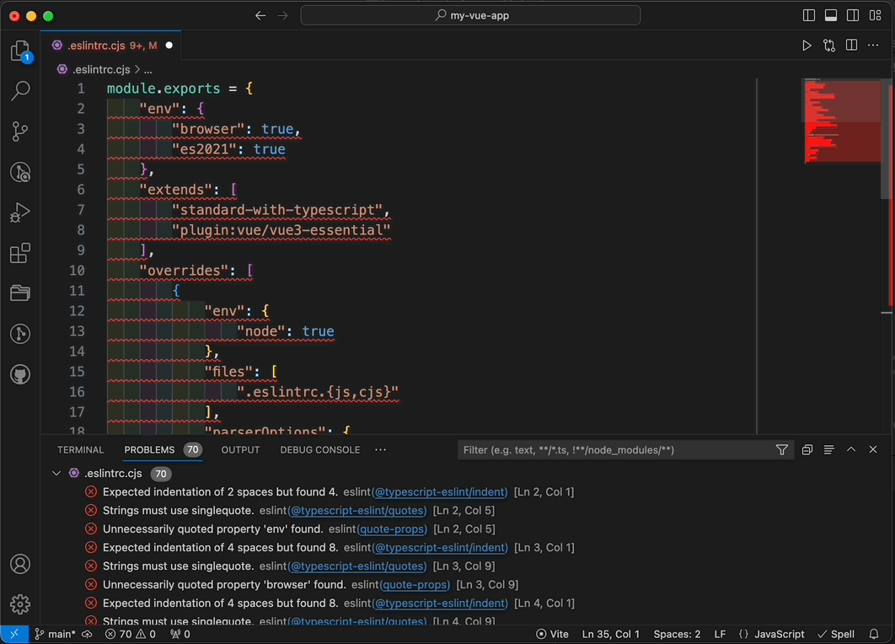
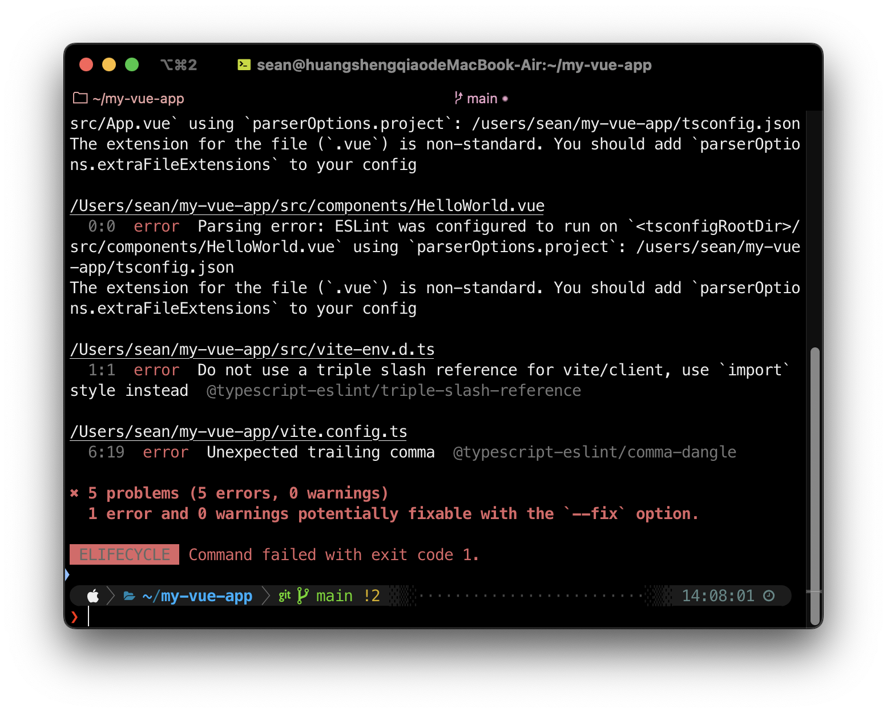
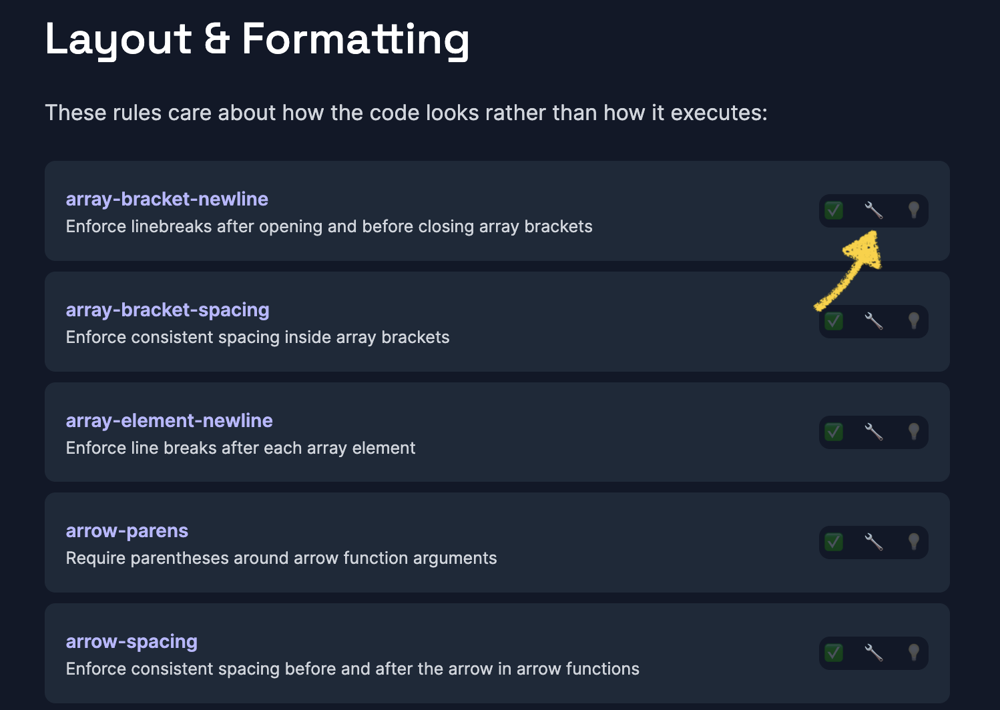

> 以下使用 pnpm 作為套件管理工具，與 npm 或 yarn 的指令會有些許差異，請查看隨附的官方文件

完整配置範例：https://github.com/ngseke/vite-vue-ts-eslint-example


## 🏗️ 透過 Vite 官方的 Preset 新建專案

> [Scaffolding Your First Vite Project](https://vitejs.dev/guide/#scaffolding-your-first-vite-project)

```shell
pnpm create vite my-vue-app --template vue-ts
```

移動到該目錄並安裝相依

```shell
cd my-vue-app
pnpm i
```

## 🏗️ 初始化 ESLint

> [Getting Started with ESLint - Quick start](https://eslint.org/docs/latest/use/getting-started#quick-start)

```shell
pnpm create @eslint/config
```

依序回答以下問題：

> ✔ How would you like to use ESLint? · **style**
> ✔ What type of modules does your project use? · **esm**
> ✔ Which framework does your project use? · **vue**
> ✔ Does your project use TypeScript? · No / **Yes**
> ✔ Where does your code run? · **browser**
> ✔ How would you like to define a style for your project? · **guide**
> ✔ Which style guide do you want to follow? · **standard-with-typescript**
> ✔ What format do you want your config file to be in? · **JavaScript**
> ✔ Would you like to install them now? · No / **Yes**
> ✔ Which package manager do you want to use? · **pnpm**

此時根目錄下便會新建 `.eslintrc.cjs`

## 😵 處理 VSCode Output 的 ESLint 的問題

雖然 ESLint 已初始化完成，但你會發現它並沒有正常運作。例如試著在任意 `.ts` 或 `.vue` 檔隨便加多餘的空格，卻看不到預期的 error 或 warning 的波浪底線。

查看 Output 會看到以下錯誤訊息：



> An unexpected error occurred:
> Error: Error while loading rule '@typescript-eslint/dot-notation': You have used a rule which requires parserServices to be generated. You must therefore provide a value for the "parserOptions.project" property for @typescript-eslint/parser.

根據錯誤訊息的描述，得知需要在 `.eslintrc.cjs` 補上 `parserOptions.project`，並且也要指明 `parserOptions.parser`。

```diff
// .eslintrc.cjs
module.exports = {
    // ...
    "parserOptions": {
        "ecmaVersion": "latest",
        "sourceType": "module",
+       project: './tsconfig.json',
+       parser: '@typescript-eslint/parser',
    },
}
```

再次查看 Output 錯誤訊息已消失




> Q: 為什麼是 **`parserOptions.parser`** 而非 `parser`？
> A: 根據[官方文件](https://eslint.vuejs.org/user-guide/#how-to-use-a-custom-parser
)說明，若寫在 `parser` 會把 `vue-eslint-parser`  覆蓋掉而無法正常地 lint `.vue` 檔。所以當有自訂的 parser 時（例如 `@typescript-eslint/parser`），必須把它移入 `parserOptions`。

## 😵 處理根目錄檔 TSConfig include 的問題

雖然 Output 錯誤訊息已消失，但這時用 VSCode 開啟在根目錄的 `.ts` 和 `.cjs` 檔，例如 `vite.config.ts` 和`.eslintrc.cjs`，會發現它們在開頭都多了紅色的波浪底線：



> Parsing error: ESLint was configured to run on `<tsconfigRootDir>/.eslintrc.cjs` using `parserOptions.project`: /users/sean/my-vue-app/tsconfig.json
> However, that TSConfig does not include this file. Either:
> - Change ESLint's list of included files to not include this file
> - **Change that TSConfig to include this file**
> - Create a new TSConfig that includes this file and include it in your parserOptions.project
> See the typescript-eslint docs for more info: https://typescript-eslint.io/linting/troubleshooting#i-get-errors-telling-me-eslint-was-configured-to-run--however-that-tsconfig-does-not--none-of-those-tsconfigs-include-this-filee

根據錯誤訊息可以得知，我們必須在 `tsconfig.json` 的 `includes` 中手動加入這些檔案：

```diff
// tsconfig.json
{
  // ...
  "include": [
    "src/**/*.ts",
    "src/**/*.d.ts",
    "src/**/*.tsx",
    "src/**/*.vue",
+   "vite.config.ts",
+   ".eslintrc.cjs"
  ],
}
```

> 日後若是在根目錄有新的 `.ts`, `.js`, `.cjs` 檔等，例如安裝 Tailwind CSS 會有的 `tailwind.config.ts`，也要記得手動加入進去。

接著重新載入 VSCode 視窗
> 叫出指令視窗 `⌘ + shift + P`  → 輸入 `Developer: Reload Window`




打開 `.eslintrc.cjs` 可以看到 ESLint 終於正常運作了，它開始確實根據 [eslint-config-standard-with-typescript](https://github.com/standard/eslint-config-standard-with-typescript) 的預設規則進行檢查，例如多餘的引號、字串應為單引號和縮排應為 2 格空格等。





## 😵 處理 `.vue` 檔的 non-standard 問題

打開任意 `.vue` 檔會發現它們也出現了錯誤訊息：



> Parsing error: ESLint was configured to run on `<tsconfigRootDir>/src/App.vue` using `parserOptions.project`: /users/sean/my-vue-app/tsconfig.json
> The extension for the file (`.vue`) is non-standard. **You should add `parserOptions.extraFileExtensions` to your config.**

根據錯誤訊息的提示在 `.eslintrc.cjs` 加入 `parserOptions.extraFileExtensions` ：

```diff
// .eslintrc.cjs
{
    // ...
    "parserOptions": {
        "ecmaVersion": "latest",
        "sourceType": "module",
        project: './tsconfig.json',
        parser: '@typescript-eslint/parser',
+       extraFileExtensions: ['.vue']
    },
}
```

再次重新載入 VSCode 視窗即可。

## 😵‍💫 跳過檢查某些檔案

### `dist/`

我們沒必要檢查建構好的已醜化和壓縮的檔案，因此可以在 `.eslintrc.cjs` 的 `ignorePatterns` 排除掉整個 `dist` 目錄：


```diff
// .eslintrc.cjs
module.exports = {
    // ...
+   ignorePatterns: ['dist'],
}
```


### `vite-env.d.ts`

按照預設規則，`vite-env.d.ts` 會違反 `@typescript-eslint/triple-slash-reference` 這條規則，建議可以在 `vite-env.d.ts` 的開頭加上註解 `// eslint-disable-next-line ...` 來跳過檢查：

```typescript
// eslint-disable-next-line @typescript-eslint/triple-slash-reference
/// <reference types="vite/client" />
```

## ✅ 大功告成

到此為止 ESLint 應該就可以順利的運作，接著你可以更進一步根據個人或團隊的風格和偏好調整 `rules`，開啟、關閉或調整某些規則。

例如我總是習慣微調 [@typescript-eslint/comma-dangle](https://eslint.org/docs/latest/rules/comma-dangle)（行末逗號）的設定，讓最後一項依然保留逗號，這樣就可以更方便調整物件成員的順序：

```typescript
module.exports = {
  // ...
  rules: {
    // ...
    '@typescript-eslint/comma-dangle': ['error', {
      arrays: 'always-multiline',
      objects: 'always-multiline',
      imports: 'always-multiline',
      exports: 'always-multiline',
      functions: 'only-multiline',
    }],
  },
}
```



## ✨ 設定 VSCode 存檔時自動排版

你還可以讓開發體驗變的更舒適。

打開 `.vscode/settings.json`，若原本沒有這個檔案可以手動建立一個，加入以下設定：

```typescript
{
  // ...
  "editor.codeActionsOnSave": {
    "source.fixAll.eslint": true
  },
}
```

回到剛才滿江紅的 `.eslintrc.cjs` 測試看看，在手動存檔（`⌘ + S`）後就會自動排版和修正錯誤：



## ✨ 透過 script 檢查錯誤或是自動修復錯誤

儘管在 VSCode 中的檢查和錯誤提示有助於得到即時反饋，但這些提示終究是 **「消極的」** 。如果開發者使用別款 IDE，或只是單純對提示視若無睹，他們仍然可以輕易地違反這些規則，並提交不符合規則的程式碼。

因此我們還需要透過 script 的方式來真正的執行規則檢查。


### 用指令檢查錯誤

打開 `package.json`，在 `scripts` 中加入指令 `lint`，其中 `--ext` 的後面是想要檢查的副檔名：
```diff
// package.json
{
  // ...
  "scripts": {
    "dev": "vite",
    "build": "vue-tsc && vite build",
    "preview": "vite preview",
+   "lint": "npx eslint . --ext .ts,.js,.cjs,.vue"
  },
}
```

接著在 terminal 測試執行效果

```shell
pnpm run lint
```

可以看到它列出了所有不符合設定規則的 error 和 warning，並且回傳 `exit code 1`。



這表示你就可以將這條指令整合進你的部署流程中，例如：

1. **搭配 [husky](https://typicode.github.io/husky/)**：使用 husky 可以在每次 commit 前自動執行 `pnpm run lint`。如果程式碼不符合規則就不給 commit，迫使開發者修復錯誤後再進行 commit，確保 code base 的風格始終維持一致
1. **CI/CD**：你可以將 `pnpm run lint` 加入 CI/CD 流程，這樣在每次部署前都會自動進行代碼檢查。若檢查失敗，部署流程就會自動中斷，讓開發者不得不修正錯誤

### 用指令自動修復錯誤

打開 `package.json`，在 `scripts` 中加入以下指令 `lint-fix`：

```diff
// package.json
{
  // ...
  "scripts": {
    "dev": "vite",
    "build": "vue-tsc && vite build",
    "preview": "vite preview",
    "lint": "npx eslint . --ext .ts,.js,.cjs,.vue",
+   "lint-fix": "npx eslint --fix . --ext .ts,.js,.cjs,.vue"
  },
}
```

接著在 terminal 測試執行效果

```shell
pnpm run lint-fix
```

順利的話「**可自動修正**（automatically fixable）」的那些規則都會被自動修正，也就是在 [Rule 列表](https://eslint.org/docs/latest/rules/)有 🔧 符號的那些項目。


