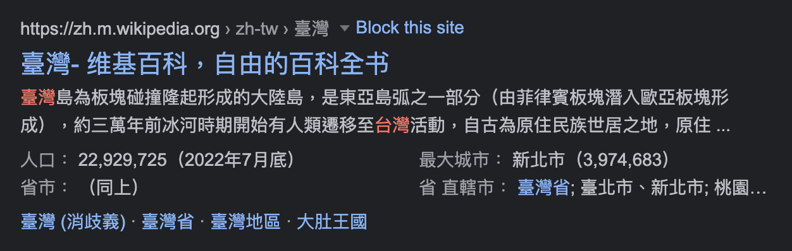

## 腳本連結

https://gist.github.com/ngseke/5d0f9ef02aa320e969768aaa8e5d888a

## 說明

不知道從何時開始，Google 搜尋結果的維基百科連結，在不知不覺間都變成了行動版本。然而行動版在筆電上總有一股違和感，也可能是我早已看習慣舊版的了。

於是我寫了一段簡單的 [Tampermonkey](https://www.tampermonkey.net/) 腳本，用來轉換 Google 搜尋結果中所有的維基百科連結，將行動版轉換成桌面版，也就是把網址的 `.m` 部分給去掉。

## 轉換結果

**Before:**

**After:**

