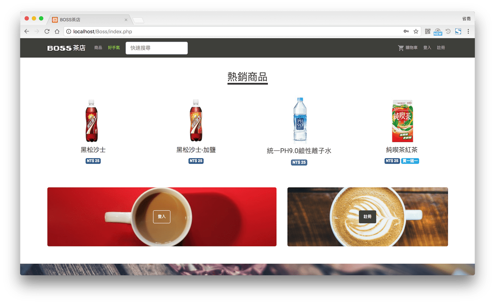
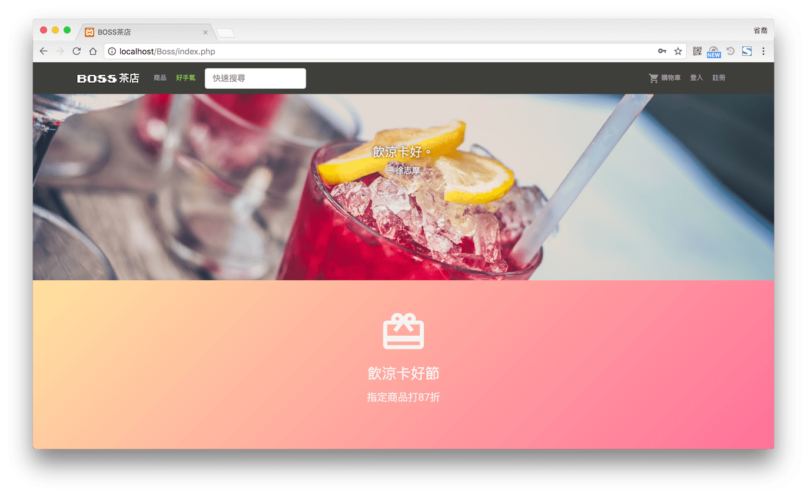
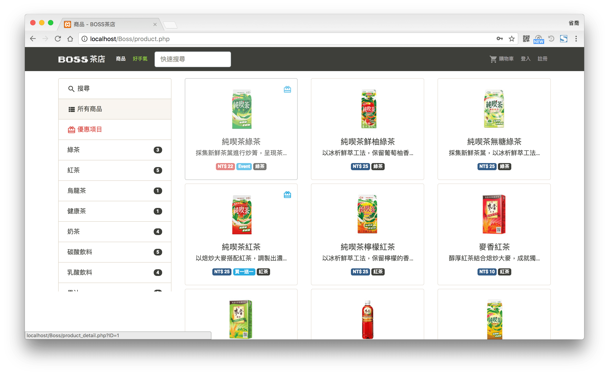
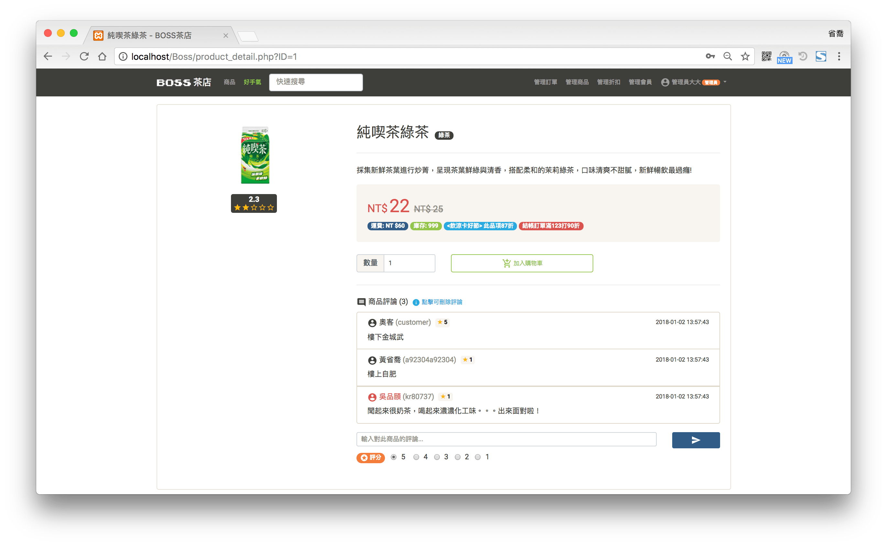

這是一個在線飲料購物系統 (Beverage Online Shop System)，簡稱BOSS，是一個簡單易用，介面時尚清爽的飲料購物平台。本專案後端以PHP語言撰寫，前端以Bootstrap的架構搭配HTML5和CSS3作為基礎進行版型設計。

在此系統中可以根據不同使用者身份，包括顧客、員工及管理員，提供各種不同的操作功能。
我們提供簡單直覺易懂的操作界面，讓顧客可以瀏覽本店所有商品、根據分類或搜尋條件取得商品資訊、對於產品及訂單進行打分或評論、查看。
員工可以上下架商品、管理商品之庫存及資訊、查看當前所有訂單資訊。管理者可以新增移除或修改會員資訊。

## 介面

## Demo

~~[http://boss.ngseke.me/](http://boss.ngseke.me/)~~ 已下架

<iframe src="https://ghbtns.com/github-btn.html?user=ngseke&repo=boss&type=star&count=false" frameborder="0" scrolling="0" width="150" height="20"></iframe>
