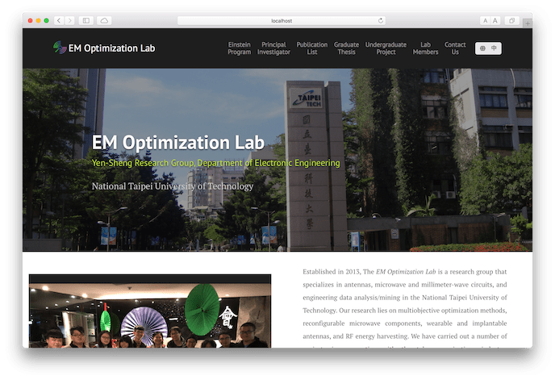
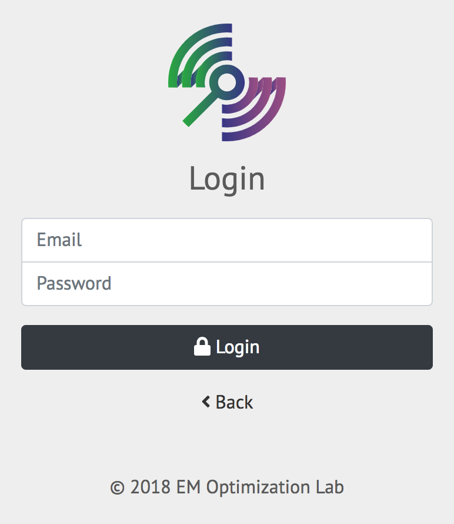
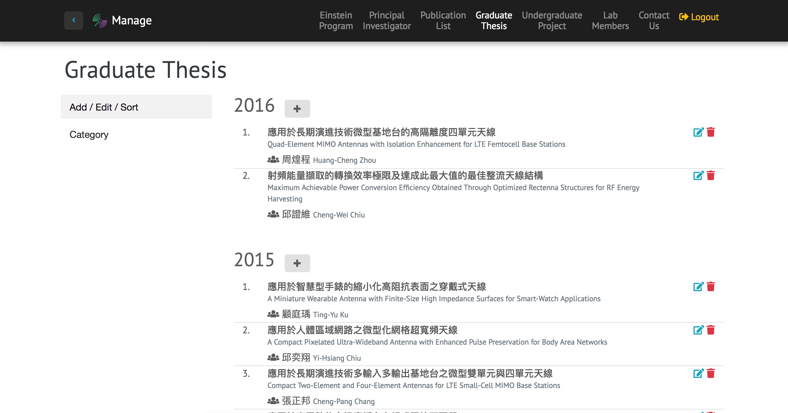
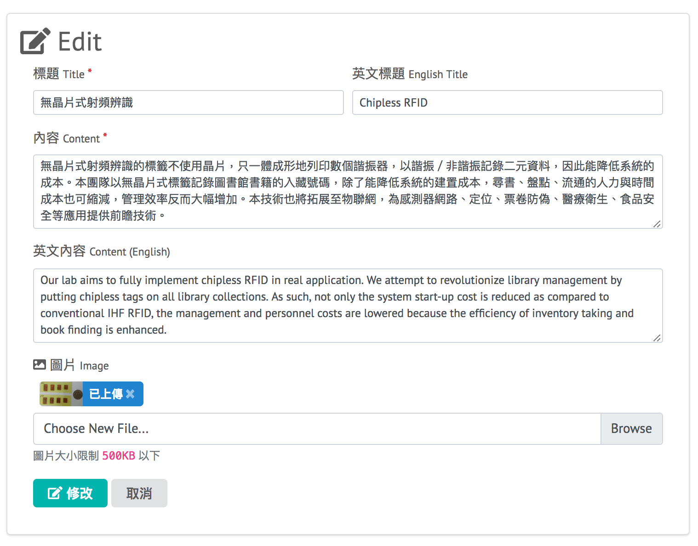
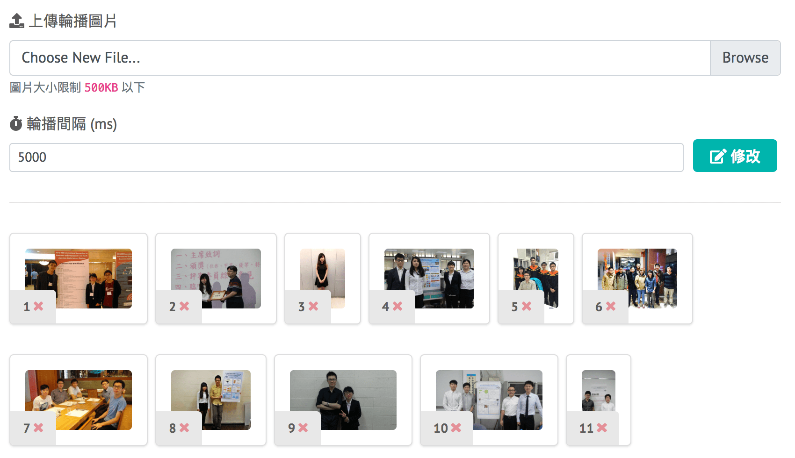

這是台北科技大學之電磁最佳化實驗室 (EM Optimization Lab) 的網站，包含 RWD 來增進不同裝置上的瀏覽體驗。

前端主要以 Vue 架構，使用 Sass 和 Pug 搭配 Gulp 自動化流程工具編譯，使用 Firebase 作為資料庫。

## 後台管理

網站提供了簡單易用的後台介面，讓管理者能方便快速地更新頁面內容，如**修改首頁近期活動**、**上傳輪播照片**、 **修改實驗室成員** 等。

考慮到網站部署空間的限制，因為學校提供的上傳空間只支援靜態網頁，所以資料庫選擇使用 **Firebase**，其最大的特色就是只靠靜態的前端網頁就可以操作 database。此外它也可以靠 JS 來上傳檔案到儲存空間，也提供驗證登入的功能，讓擁有權限的使用者才可進入後台編輯。

## Demo

[https://myweb.ntut.edu.tw/~yschen/](https://myweb.ntut.edu.tw/~yschen/)

<iframe src="https://ghbtns.com/github-btn.html?user=ngseke&repo=emo&type=star&count=false" frameborder="0" scrolling="0" width="150" height="20"></iframe>
