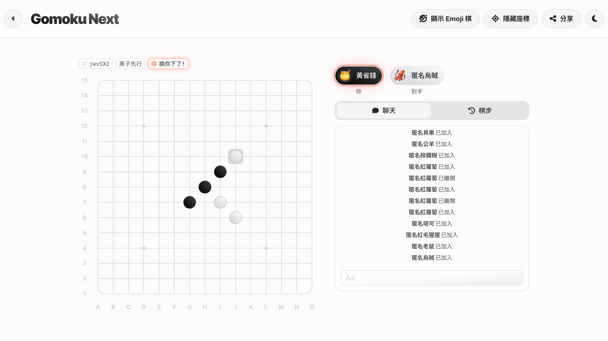
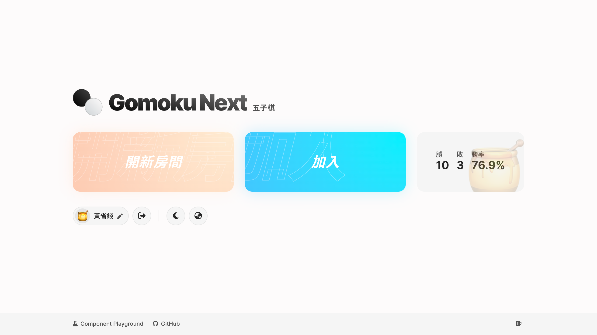
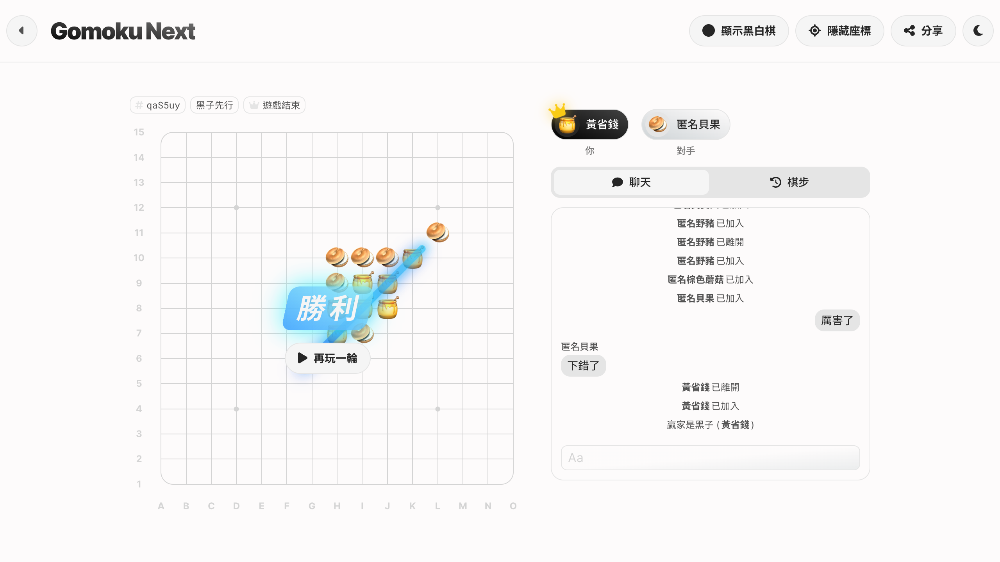
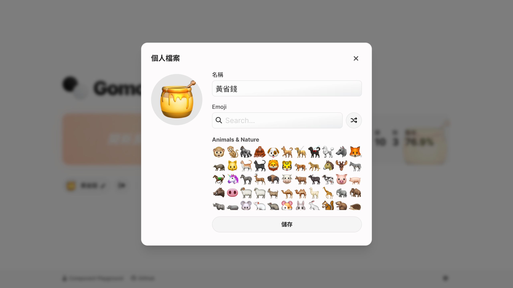
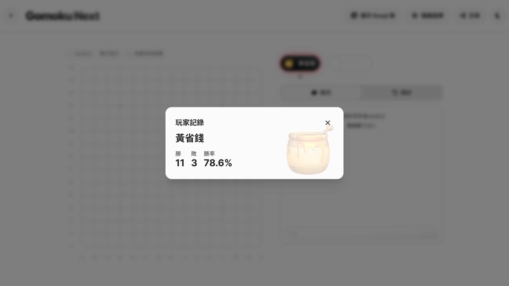

> **Gomoku Next** 是 [Gomoku (2018)](/project/gomoku) 的重製版本

## 功能簡介

[Gomoku Next](https://gomoku.ngseke.me) 是使用 Next.js 14 開發的線上五子棋遊戲，具有以下豐富功能：

1. 建立或透過 ID 加入房間
1. 以 Google 帳號或是訪客模式登入
1. 編輯個人檔案：名稱和 Emoji
1. 無禁手的五子棋對弈
1. 聊天室
1. 棋步覆盤
1. 查看自己和對手的戰績
1. 深色模式
1. i18n：支援英文、正體中文、日文、韓文

## 技術說明

1. Next.js 14 + TypeScript + Tailwind CSS
1. 使用 `next-intl` 實作 i18n
1. 使用 `@reduxjs/toolkit` 管理全域狀態
1. 使用 Firebase Realtime Database 作為後端資料庫
1. 使用 Firebase Authentication 處理身份驗證
1. 透過 Route Handler 處理所有由 client 端主動發起的請求並寫入資料庫
1. 部署至 Vercel

## 遊戲畫面

## Demo

[https://gomoku.ngseke.me](https://gomoku.ngseke.me)

<iframe src="https://ghbtns.com/github-btn.html?user=ngseke&repo=gomoku-next&type=star&count=false" frameborder="0" scrolling="0" width="150" height="20"></iframe>
