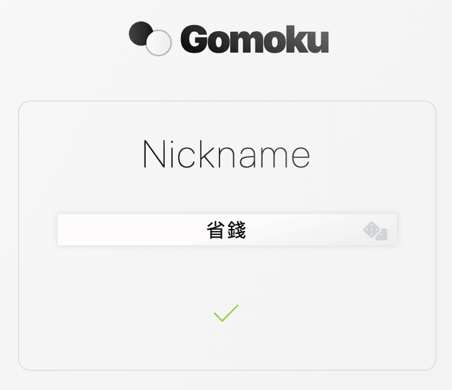
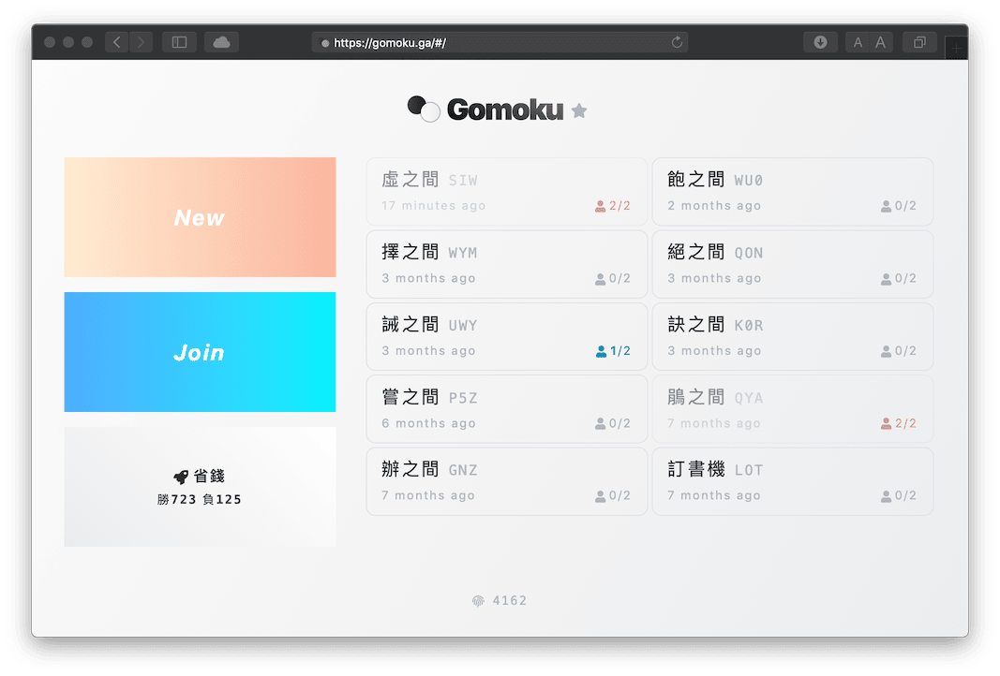
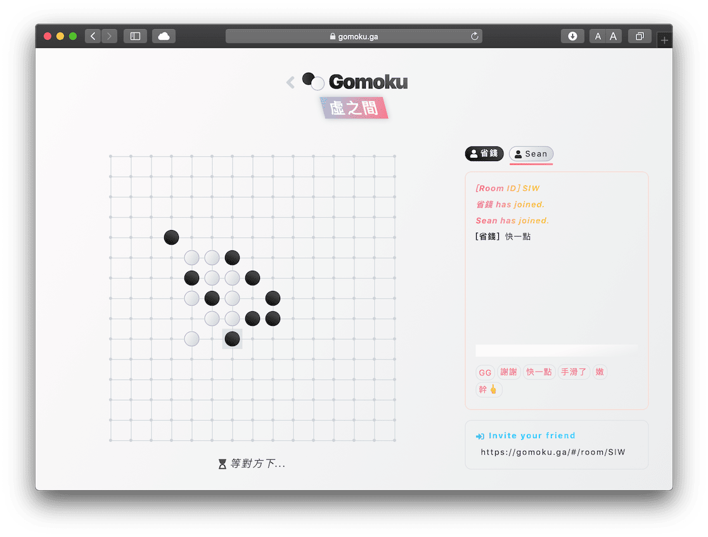
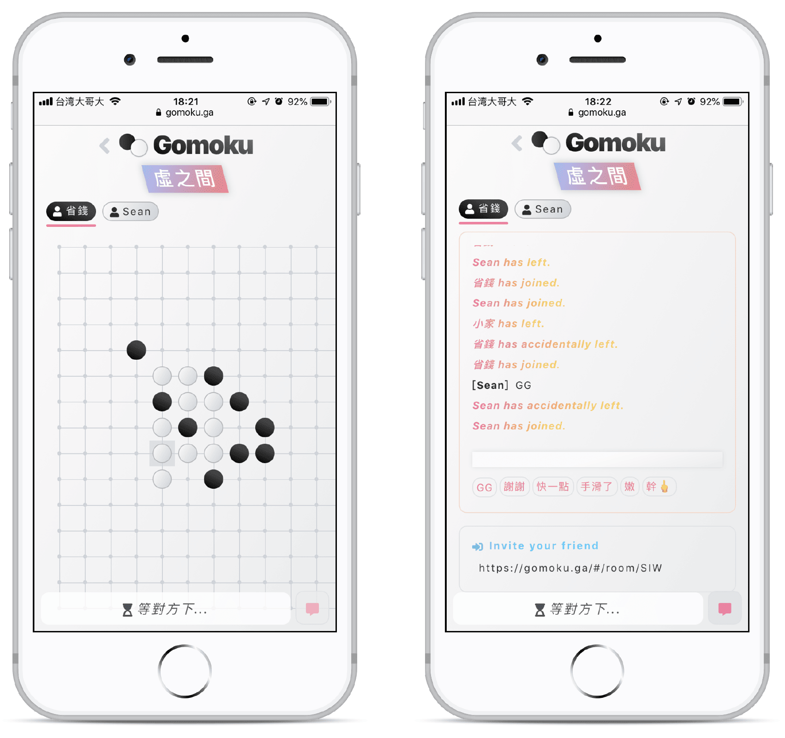

[Gomoku: 五子棋對戰](https://gomoku.ga/)是簡約的五子棋遊戲，是與小夥伴在悠閒午後消磨時間的良伴。

## Demo

[https://gomoku.ga/](https://gomoku.ga/)

<iframe src="https://ghbtns.com/github-btn.html?user=ngseke&repo=gomoku&type=star&count=false" frameborder="0" scrolling="0" width="150" height="20"></iframe>
