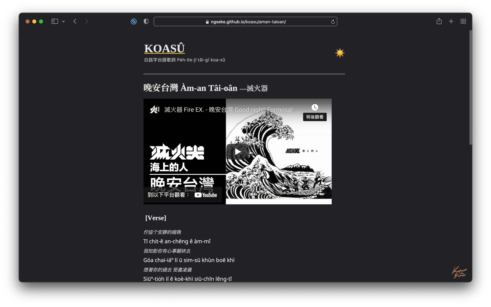

KOASÛ 也就是台語「<ruby>歌詞<rt>koa-sû</rt></ruby>」的白話字。

本網誌基於 Hexo 架設，主要受到[台客鬼](https://taikegui.wordpress.com/)和[歌詞正字](https://kuasu.tgb.org.tw/)的啟發，補全它們未收錄的台語歌詞，特別是某些非主流歌曲，例如[來去高雄](https://ngseke.github.io/koasu/laikhi-kohiong/)。本人將這些歌詞翻譯成符合教育部所規範的台文正字，並以白話字表記發音，也希望藉此過程來提高自己對白話字的掌握度。

台文漢字的選用與拼法主要參考[臺灣閩南語常用詞辭典](https://twblg.dict.edu.tw/holodict_new/)、[萌典](https://www.moedict.tw/)和[iTaigi 愛台語](https://itaigi.tw/)。

## Demo

[https://ngseke.github.io/koasu/](https://ngseke.github.io/koasu/)

<iframe src="https://ghbtns.com/github-btn.html?user=ngseke&repo=koasu&type=star&count=false" frameborder="0" scrolling="0" width="150" height="20"></iframe>
