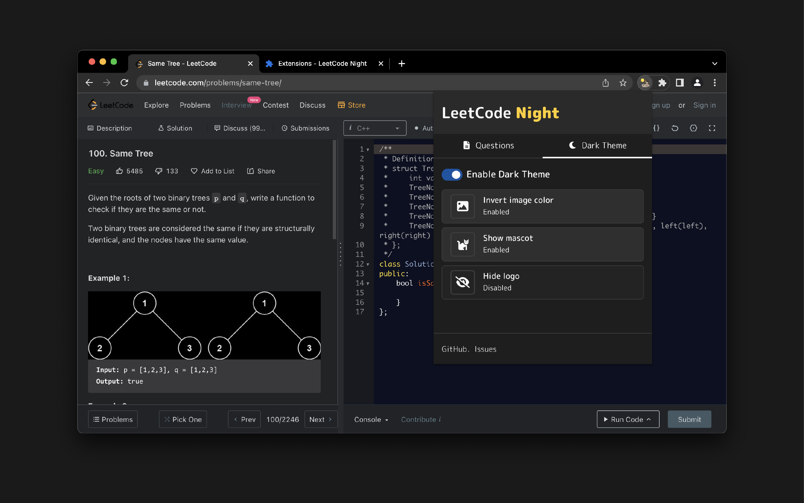
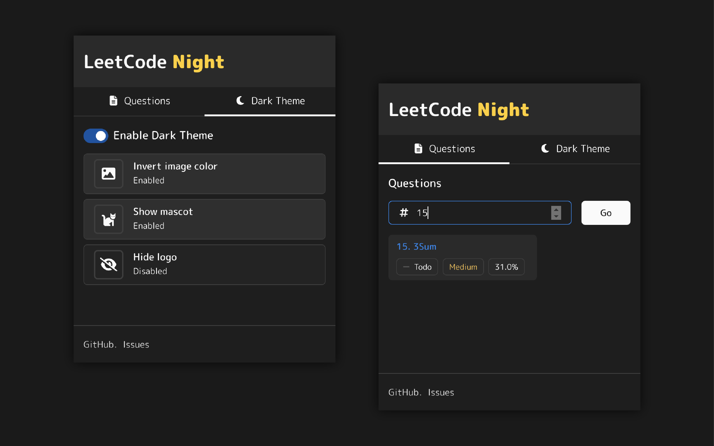

長久以來都只有[中國版力扣](https://leetcode-cn.com/)支援完整的暗黑模式，可惜美國 LeetCode 主站則僅有在 Problem List、Profile 等少數頁面頁才支援，而獨缺解題頁。

某夜在深夜刷題的我，突發奇想，說不定可以取力扣的色票，直接複寫 LeetCode 的 CSS 樣式來實現深色模式，於是誕生了 *LeetCode Night*。

原本也僅僅是寫好玩，就扔到了 GitHub 上，甚至名字也是隨意取的。後來發現其實[蠻多人](https://leetcode.com/discuss/general-discussion/544429/dark-mode)都在跟官方敲碗深色模式。因此後來我決定把它上架到商店，讓它變得更親民、更容易安裝。對我來說，這也是個難得可以從頭到尾，完整地開發擴充套件的機會。過程除了前端相關的開發、打包、上版號，甚至也包含 UI 和 Logo 設計 、截圖和宣傳橫幅的設計、發布送審套件等。

經過了半年左右時間，使用者終於人數突破了 1K，還拿到了一個小藍勾勾（徽章），也算是達成了不值得一提的小成就吧。

## 簡介

*LeetCode Night* 是 Google Chrome 的擴充功能，讓使用者在題目頁也可以套用深色模式，即使在夜晚刷題也不必擔心瞎眼。

- TypeScript
- UI 組件基於 [Tocas UI v4](https://v4.tocas-ui.com/) 建構，搭配 styled-component 自定義樣式
- 使用 Axios 和 GraphQL 請求題目列表
- 使用 react-i18next 本地化
- 透過 Webpack css-loader 向頁面注入複寫用的 SASS 樣式

此外還有附加以下便利功能：

1. 反相圖片顏色，讓題目中多數白底的插圖，在深色模式中也不至於太突兀
2. 輸入 Question Number 來迅速跳轉至題目頁，此插件會將題目列表緩存至本機，無需等待 API 回應
3. 自動清空編輯器裡前一次送出過的程式碼，特別適合刷題狂人，避免不小心瞄到答案

## Demo

 
 

<iframe src="https://ghbtns.com/github-btn.html?user=ngseke&repo=leetcode-night&type=star&count=false" frameborder="0" scrolling="0" width="150" height="20"></iframe>
