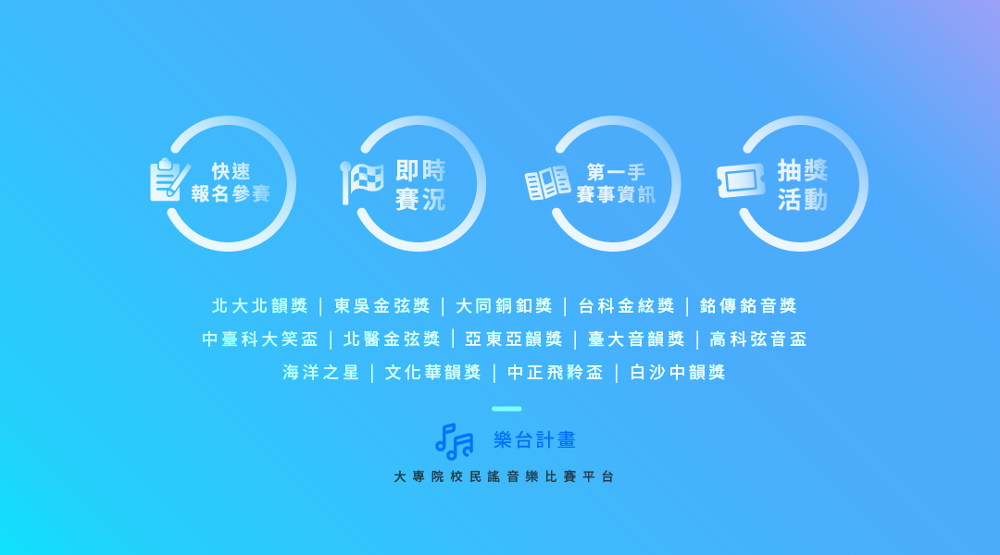
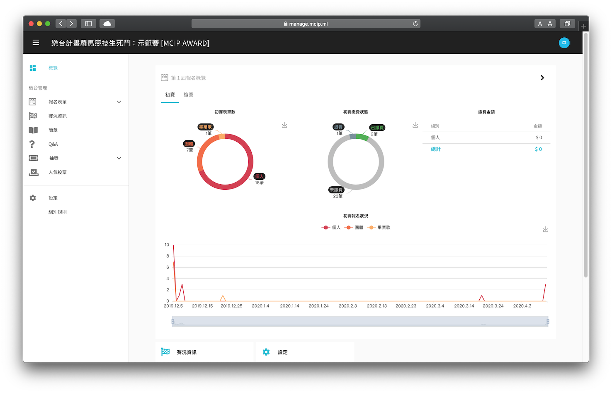
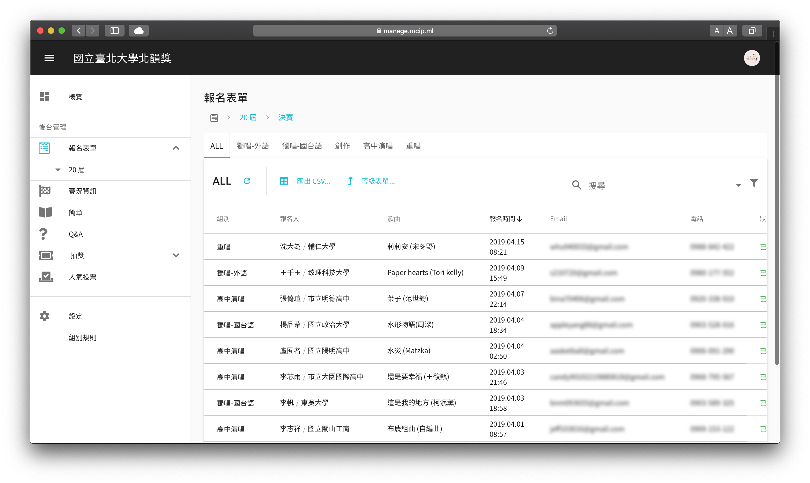
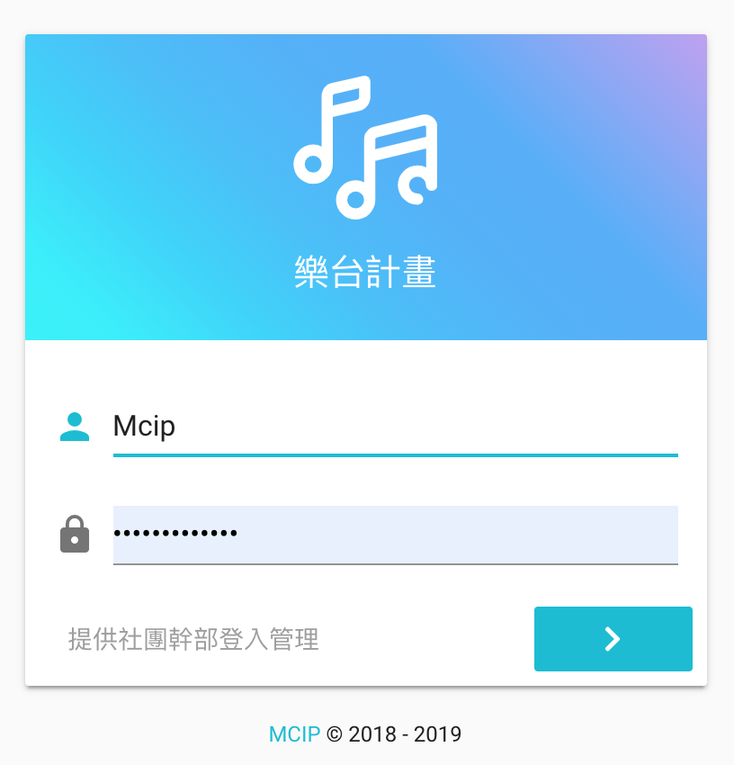
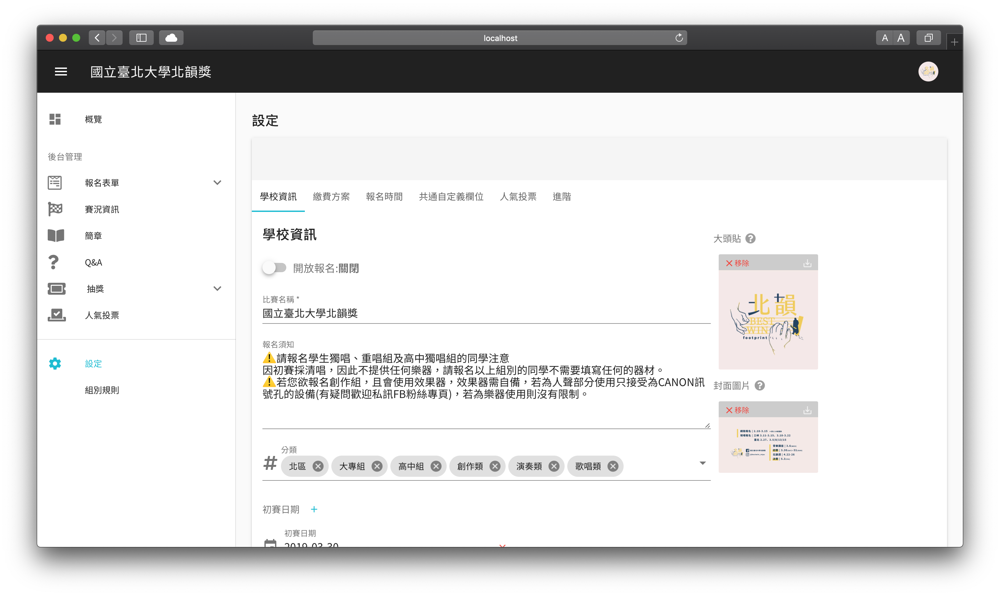

[樂台計畫](https://mcip.ml/)誕生於 2018 年之冬，是我與大學好友鎧企（K7）攜手開發的大專院校音樂平台。我們皆來自吉他社，體認到各個賽事在籌辦時的痛點，於是樂台計畫應運而生，宗旨是打造更優質的音樂賽事環境，簡化社團在處理報名業務的作業流程。

在上線屆滿一年來，樂台計畫傾聽了來自各方用戶的反饋和建議，持續優化系統與擴展規模。

對於參賽者，樂台計畫以 Line App 官方帳號的形式，讓用戶輕鬆簡單地報名參賽，瀏覽各賽事的詳細資訊，還有查看當前比賽進度等功能。目前用戶數已超過 6,000 人，全台從北到南，共計有 26 所大專院校的音樂社團與我們成為合作夥伴。

而對於主辦比賽的社團成員們，樂台計畫提供一套完整的後台管理系統。
在此項目中本人負責的是**後台管理系統**開發與部分 Line App **UI/UX 設計**。

管理後台基於 Vuetify 建置，借助這些開箱即用的 Material Design 風格組件，使我們在在初期得以快速地迭代原型。

此系統落實前後端分離，使用 Axios 與後端串接資料。我與後端合力規劃並協調 API 的規格，也包含了 Database Schema 的設計。在樂台計畫草創時期，我們根據業務邏輯，並考慮 NoSQL 的特性，妥善設計出合理的資料庫架構。

本專案使用 Pug 模板語言撰寫，透過縮排便能靈活地調整 HTML 的巢狀結構。

---

related project: [《樂台計畫》官方網站](/project/mcip)
