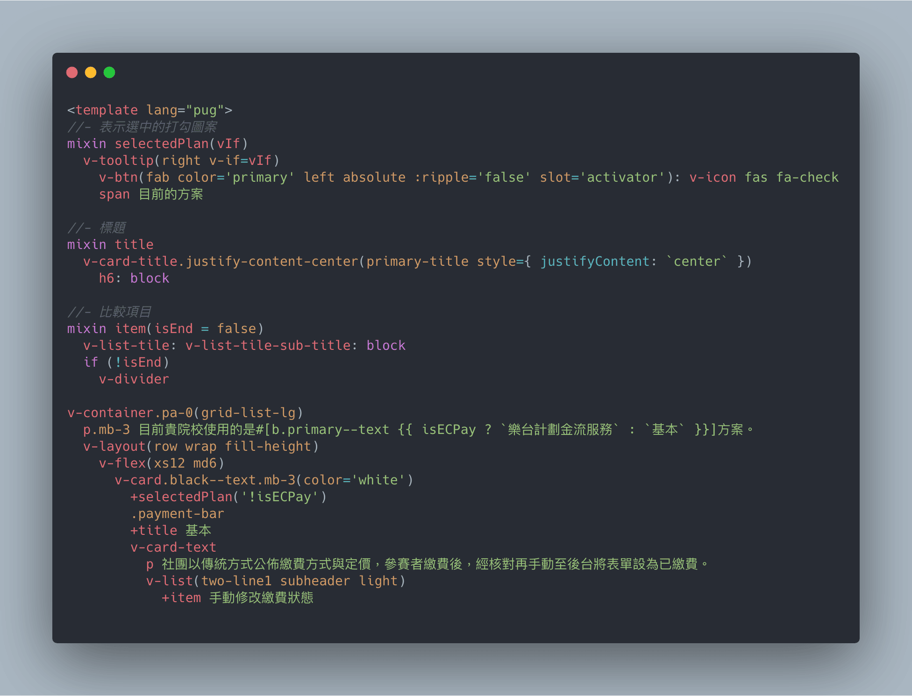
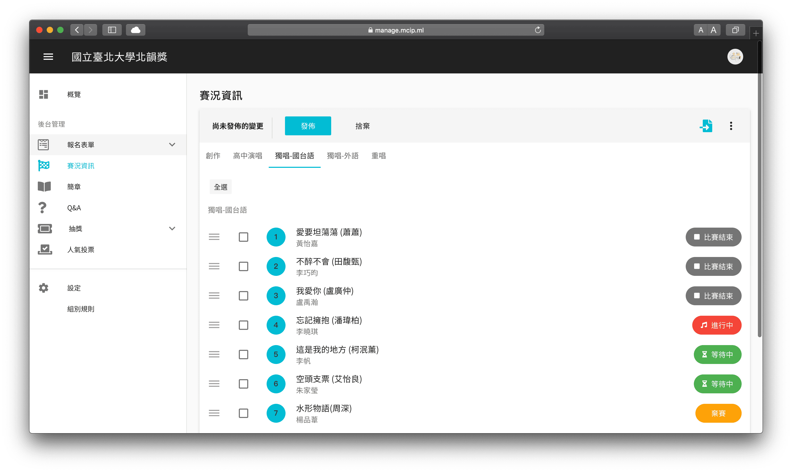

[樂台計畫](https://mcip.ml/)誕生於 2018 年之冬，是我與大學好友鎧企（K7）攜手開發的大專院校音樂平台。我們皆來自吉他社，體認到各個賽事在籌辦時的痛點，於是樂台計畫應運而生。樂台計畫專為音樂賽事量身打造，宗旨是建構更優質的賽事環境，簡化社團在處理報名業務的作業流程。

服務上線至今，樂台計畫傾聽來自各方使用者的回饋和建議，持續優化系統與擴展規模。

對於參賽者，樂台計畫以 Line App 官方帳號的形式，讓使用者輕鬆簡單地報名參賽、瀏覽各賽事詳情，甚至可以查看當前比賽進度。目前使用者數已超過 6,000 人，全台從北到南，共計有 26 所大專院校的音樂社團成為我們的合作夥伴。

而對於主辦比賽的社團幹部們，樂台計畫提供一套完整的後台管理系統。在此專案中我主要負責的是**後台管理系統**前端開發，與一部分 LINE App 的 **UI/UX**。

管理後台大部分組件取自 Vuetify ，得益於這些開箱即用的 Material Design 風格組件，讓我們可以更專注在功能需求上，在初期得以快速地迭代原型。

此系統落實前後端分離，使用 Axios 與後端串接資料。我與後端合力規劃並協調 API 的規格，當中包含了 Database Schema 設計。在樂台計畫草創期，我們根據業務邏輯並考慮 NoSQL 的特性，妥善設計出合理的系統架構。

本專案使用 Pug 模板語言撰寫，透過縮排便能很靈活地調整 HTML 的巢狀結構。

## Related Project

<ProjectList :list="list" class="!mt-10" />
