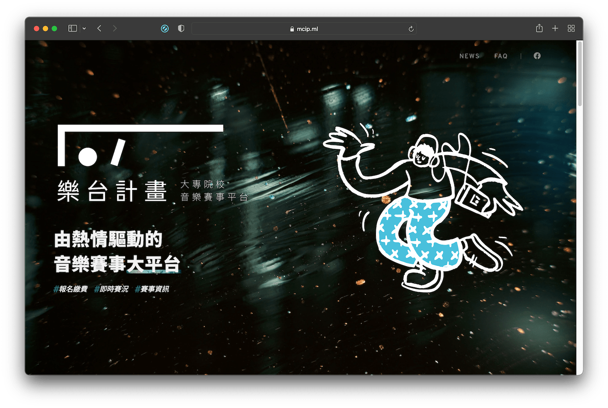
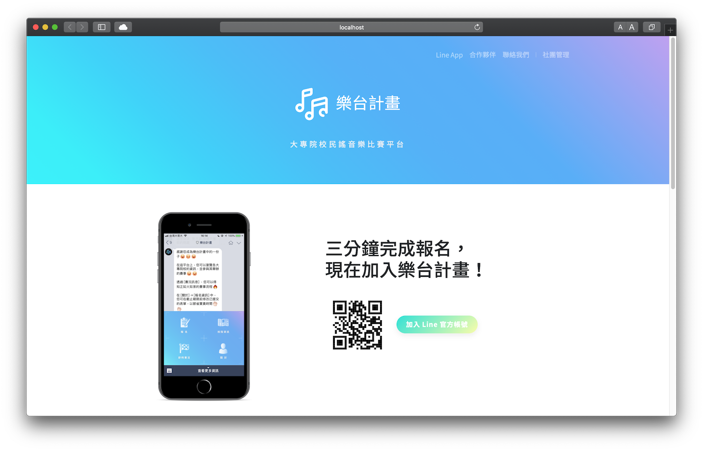
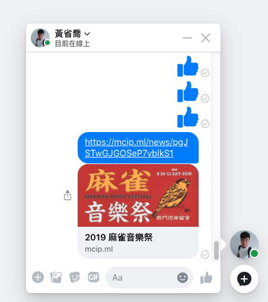
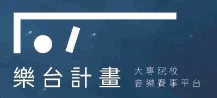

樂台計畫官方網站是基於 Nuxt 建構的 SSR 網站，現已導入 Composition API 與 ESLint，使得維護與開發工作變得更流暢。

樂台計畫在建立初期，本沒有建置官方網站的規劃。但隨著規模漸漸成長，有越來越多的人與音樂社團對我們感到好奇，這讓我們開始思考關於樂台計畫品牌的形象與推廣。為了可以接觸到更多群眾，讓更多人可以透過 Facebook 粉絲專頁以外的管道來認識我們，遂開始著手官方網站的構思。

## 舊版網站

在前期版本，網站原本的定位僅僅是希望提供一個簡易的入口，引導使用者加入樂台計畫 Line App。因此當時主要是朝著單頁式網站的方向來設計，頁面上也只放置了 QRCode 等必要資訊。

為了盡快的製作出 prototype，當時選用 Parcel 這個簡單又快速的打包工具。只要設定好進入點，它就會自動分析所有相依的資源，並自動封裝成 bundle，也省去很多需要手動配置的地方。

## 以 Nuxt 重新架構

隨著網站的內容逐漸擴充，依序加入了「合作院校」、「聯絡我們」、「最新消息」和「FAQ」等區塊，我開始思考如何優化網站 SEO，於是在後期決定改採用 Nuxt 這個 SSR 解決方案，重新架構整個網站。

在遷移到 Nuxt 後有許多顯而易見的好處，最明顯的是能做到預先抓取異步資料，並且直接把內容渲染在頁面上。其他像是 title、meta description 和 Open Graph 標籤等，也可以透過 Vue Meta 管理，一併預先渲染出來，有助搜尋引擎的爬蟲更容易地擷取頁面資料。

例如在社群媒體或是通訊軟體分享最新消息的文章時，縮圖和文章內容就能夠順利的被平台抓取，直接秀出預覽的資訊，提升使用者對連結的興趣。

## Landing Page
我為識別 Logo 設計了簡單 SVG 動畫，藉著操控 `stroke-dashoffset` 和 `stroke-dasharray` 屬性，僅靠純 CSS3 就能實現虛線描邊特效。

## Demo

[https://mcip.ml/](https://mcip.ml/)

<iframe src="https://ghbtns.com/github-btn.html?user=ngseke&repo=mcip.ml&type=star&count=false" frameborder="0" scrolling="0" width="150" height="20"></iframe>

---

related project: [《樂台計畫》後台管理系統](/project/mcip-cms)
