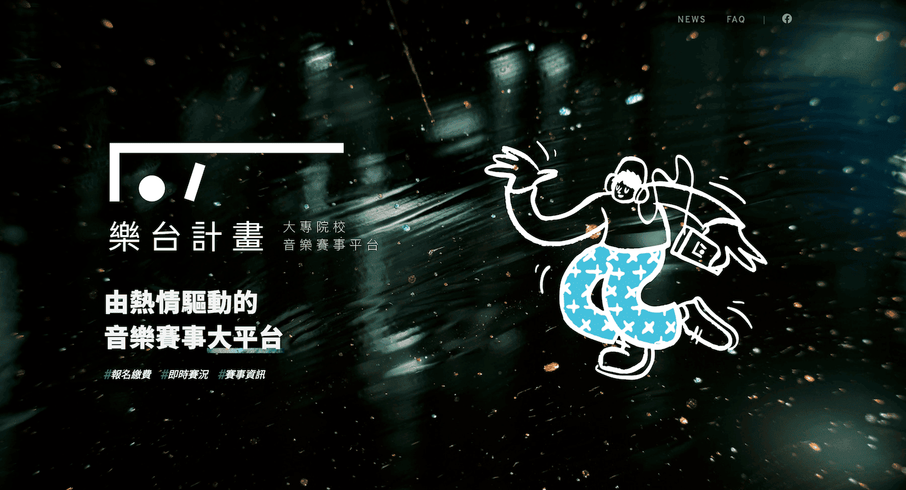

[**樂台計畫官方網站**](https://mcip.app)是以 Nuxt 建構的 SSR 形象網站。在此專案我負責的項目，包含定義網站架構與規格、UI/UX 設計、開發與部署。

> 關於《樂台計畫》平台詳細介紹請見[MCIP CMS](/project/mcip-cms)。

## 緣由

樂台計畫在初期並未規劃官方網站，但隨著規模逐漸成長，有越來越多人與音樂社團對我們感到好奇，這讓我們重新思考品牌形象的建立與加強推廣。為了能接觸到更多群眾，讓更多人可以透過 Facebook 粉絲專頁以外的管道來認識我們，遂開始著手官方網站的構思。

## 舊版網站

在原本的前期版本，網站的定位只是一個陽春的入口網站，用來引導使用者加入樂台計畫 LINE App。因此當時是朝著單頁式網站的方向來設計，畫面上也只放置了 QRCode 等必要資訊。

為了盡快的製作出 prototype，當時選用 Parcel 這個易上手的打包工具。只要設定好進入點，它就會自動分析所有相依的資源，並自動封裝成 bundle，也省去很多繁複的手動配置。

## 以 Nuxt 重新架構

隨著網站的內容的不斷擴充，逐漸加入了「合作院校」、「聯絡我們」、「最新消息」和「FAQ」等區塊，我開始思考該如何優化網站 SEO，於是在後期決定採用 Nuxt 這個 SSR 解決方案，從頭開始打造新的網站。

在遷移到 Nuxt 後有許多好處，最顯而易見的就是預先抓取非同步資料，將內容渲染在頁面後才傳送到 client 端。其他像是 title、meta description 和 Open Graph 標籤等，也可以透過 Vue Meta 統一管理，一併預先渲染出來，有助搜尋引擎的爬蟲擷取頁面資料。

例如在社群媒體或是通訊軟體分享最新消息的文章時，縮圖和文章內容就能夠順利的被平台抓取，直接秀出預覽的資訊，提升使用者對連結的興趣。

## 部署

此專案部署在 [Vercel](https://vercel.com/) 上，堪稱是最最無腦的託管平台。基本上只需要按照官方指南，在根目錄建立配置檔 `vercel.json`，接著在平台上綁定 GitHub 版本庫即可。

在預設情況下 Vercel 就內建了 CI/CD，每當任何一個分支有新的 push，它都會立即執行建構和部署，並針對每個 commit 都產生出一個預覽用的 domain，方便驗證線上的結果。

## Landing Page 的 Logo 動畫

我為識別 Logo 設計了簡單 SVG 動畫，藉著操控 `stroke-dashoffset` 和 `stroke-dasharray` 屬性，僅靠純 CSS3 就能達到酷炫的虛線描邊特效。

## Demo

[https://mcip.app/](https://mcip.app/)

<iframe src="https://ghbtns.com/github-btn.html?user=ngseke&repo=mcip.app&type=star&count=false" frameborder="0" scrolling="0" width="150" height="20"></iframe>

## Related Project

<ProjectList :list="list" class="!mt-10" />
