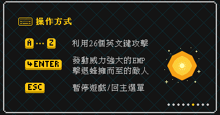
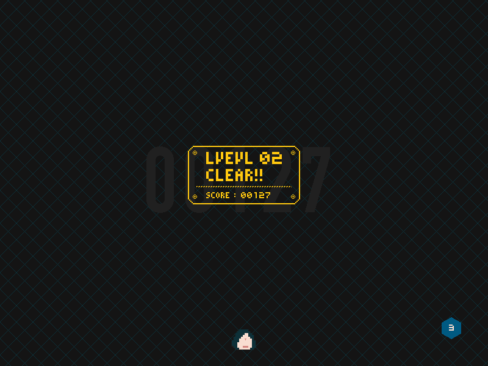

物件導向程式設計期末專題。

這是以 [ZType](http://zty.pe/) 作為靈感來源而開發的打字射擊遊戲，以 Visual Studio 2015 建立專案，基於 [Game Framework 4.8](http://www.cc.ntut.edu.tw/~wkchen/game/) 以 C++ 語言撰寫的 Windows 平台遊戲。

## 試玩影片

  <iframe class="embed-responsive-item" src="https://www.youtube.com/embed/j8L_ViHDzMY" allowfullscreen></iframe>

## 簡介
### 玩法
在本遊戲中有各種不同外貌的敵人(Enemy)，但是他們都有一個共同點，那就是他們的身上都帶著一組英文單字。玩家必須在敵人接近之前，輸入其身上的單字，才能成功的把的敵人消滅。

### 規則
本遊戲除了普通的敵人外，另外還有多種強大的Boss，除了字數較長外，還各自擁有不同的技能。
### 特殊功能
當身邊有太多敵人即將接近，而且來不及將他們消滅的時候，玩家在每場遊戲，有三次的機會可以使用技能。按下"Enter"釋放出電磁脈衝(EMP)，快速的將身邊的敵人消滅。
### 圖形/美術
我們遊戲圖形是以8 BITS復古風作為設計風格，它最大的特色就是在圖形的邊緣，看起來會有明顯的鋸齒。為了達成像素畫(Pixel Art) 的美術風格，大部分的圖形我們都是利用**小畫家**來繪製。和一般的繪圖軟體相比，小畫家非常適合來製作點陣圖，因為他可以很精確的在每一格中填色，並且可以很輕易的輸出Bmp格式的圖片，正好符合我們的需求。

## 說明畫面

## 角色選擇

## 遊戲畫面

## 其他介面

## 遊戲下載
[TypingTyping.zip (7.7mb, Windows only)](/files/TypingTyping.zip)
<iframe src="https://ghbtns.com/github-btn.html?user=ngseke&repo=Typing-Typing&type=star&count=false" frameborder="0" scrolling="0" width="150" height="20"></iframe>
