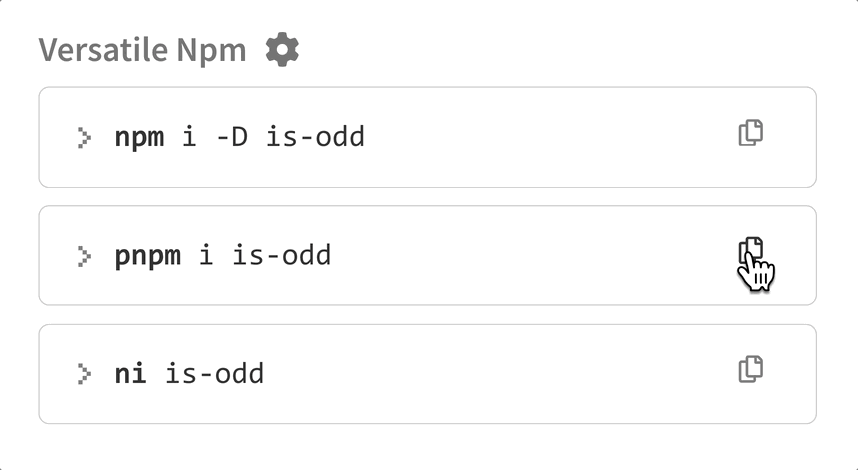
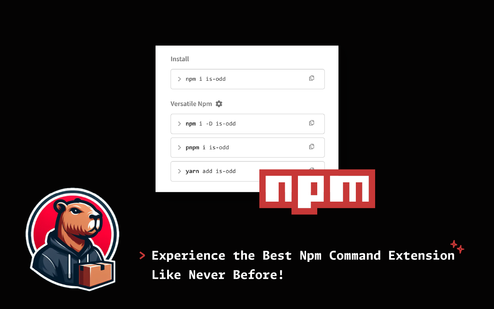
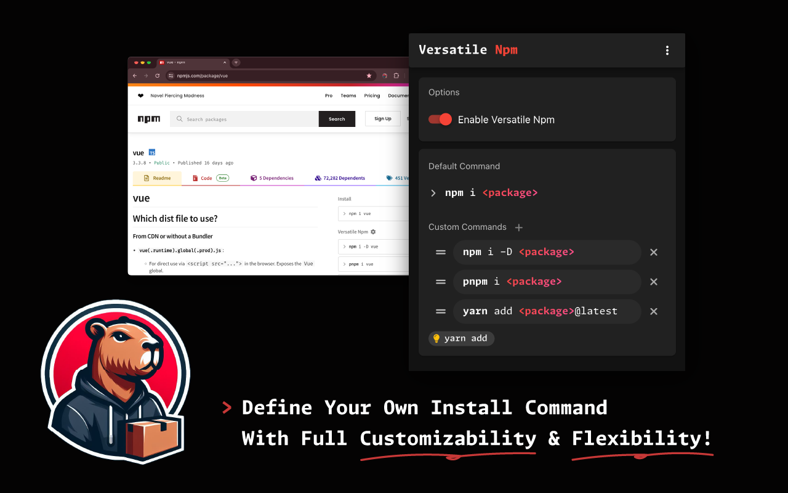
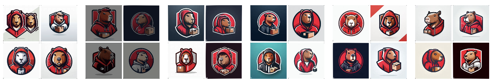

## 簡介

*Versatile Npm* 是 Google Chrome 擴充功能，使用 Vue 3 + TypeScript + Chrome Extension API + Vuetify 建構。

這個擴充功能可以讓使用者在 npm 套件頁面的右側欄加入 `yarn` 和 `pnpm` 等安裝指令，方便開發者一鍵複製。

另外也提供設定 UI 供使用者自定義安裝指令，執行新增、刪除、編輯和排序操作。

## Logo

這款 App 的 Logo 是透過 DALL·E 3 產生的，輸入 prompt 包含 `穿著帽 T 的水豚`、`包裹`、`紅色`、`badge style`、`sport mascot style`，最後透過 macOS 內建的「移除背景」功能去背。這過程不費吹灰之力，無需任何專業繪圖軟體。

其他候選 Logo 如下：

## Demo

<a href="http://versatile-npm.ngseke.me/" target="_blank">
Homepage
</a>

 

<a href="https://chromewebstore.google.com/detail/versatile-npm/jahejogdoffpehfhkhbpjblnlhghjnje?hl=zh-TW" target="_blank">
  Chrome Web Store
</a>

 
 

<iframe src="https://ghbtns.com/github-btn.html?user=ngseke&repo=versatile-npm&type=star&count=false" frameborder="0" scrolling="0" width="150" height="20"></iframe>
